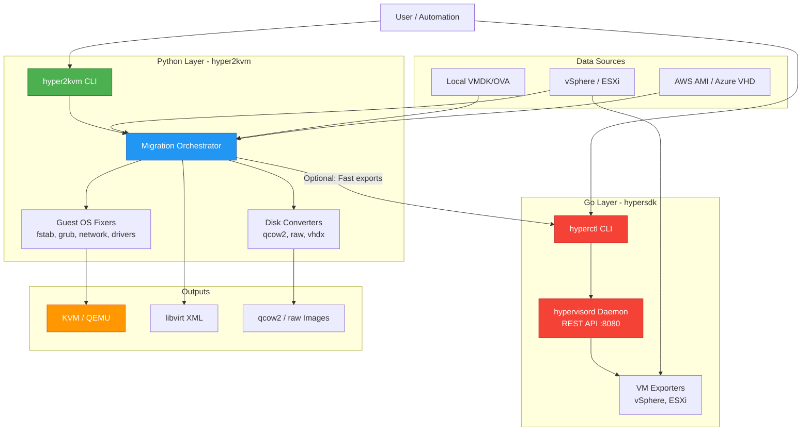

# hyper2kvm Ecosystem - Complete Guide

**Version:** 1.0.0
**Last Updated:** 2026-01-17
**Status:** Production Ready ✅

## Table of Contents

1. [Overview](#overview)
2. [Architecture](#architecture)
3. [Components](#components)
4. [Installation](#installation)
5. [Testing](#testing)
6. [Usage Examples](#usage-examples)
7. [Integration Guide](#integration-guide)
8. [Troubleshooting](#troubleshooting)
9. [Performance](#performance)
10. [Contributing](#contributing)

---

## Overview

The **hyper2kvm ecosystem** is a comprehensive VM migration solution consisting of two main projects:

### 1. **hyper2kvm** (Python)
**Repository:** https://github.com/ssahani/hyper2kvm
**PyPI:** https://pypi.org/project/hyper2kvm/
**Language:** Python 3.10+

Production-grade VM migration toolkit that converts hypervisor disks (VMware, Hyper-V, AWS AMI, etc.) to KVM-compatible formats with automatic guest OS fixes.

**Key Features:**
- Offline VM repairs using libguestfs
- Windows VirtIO driver injection
- Linux bootloader (GRUB/GRUB2) regeneration
- Network configuration stabilization
- Snapshot chain flattening
- Batch processing and daemon mode
- YAML configuration system

### 2. **hypersdk** (Go)
**Repository:** https://github.com/ssahani/hypersdk
**Language:** Go 1.24+

High-performance vSphere export provider with daemon architecture offering 3-5x faster VM exports compared to traditional tools.

**Key Features:**
- Parallel disk downloads (configurable workers)
- Resumable downloads with automatic retry
- REST API + CLI interface
- Real-time progress tracking
- Background daemon mode
- Job queue management

---

## Architecture

The ecosystem follows a **layered architecture** where the Go provider handles high-speed data extraction while the Python toolkit performs guest OS repairs.



### Component Interaction Flow

1. **Direct Python Usage** (Standard Path):
   - User runs `hyper2kvm` command
   - Python orchestrator handles everything end-to-end
   - Uses govc/pyvmomi for vSphere exports
   - Applies guest OS fixes
   - Outputs KVM-ready images

2. **Python + Go Integration** (High-Performance Path):
   - Python detects `hyperctl` availability (`HYPERCTL_AVAILABLE = True`)
   - Delegates vSphere exports to hypervisord daemon
   - Gets 3-5x faster exports via parallel downloads
   - Python continues with guest OS fixes
   - Combined benefits: speed + automatic repairs

---

## Components

### Python Components (hyper2kvm)

#### 1. Command-Line Interface
**Location:** `hyper2kvm/cli/`

Entry point for all migration operations.

```bash
# Local VMDK conversion
python -m hyper2kvm local --vmdk disk.vmdk --to-output /output/

# vSphere export and convert
python -m hyper2kvm vsphere --vm-name "Production-VM" --vs-action export

# Live SSH fixes
python -m hyper2kvm live-fix --host 192.168.1.100 --fix-all

# Daemon mode (automated processing)
python -m hyper2kvm --config daemon.yaml
```

#### 2. Migration Orchestrator
**Location:** `hyper2kvm/orchestrator/`

Coordinates the entire migration pipeline:
- FETCH: Acquire disks from source
- FLATTEN: Collapse snapshot chains
- INSPECT: Extract guest OS facts
- PLAN: Determine fix strategy
- FIX: Apply guest OS repairs
- CONVERT: Transform disk formats
- VALIDATE: Boot tests

#### 3. Guest OS Fixers
**Location:** `hyper2kvm/fixers/`

Platform-specific repair modules:

**Linux Fixers:**
- `filesystem/`: fstab UUID/LABEL stabilization
- `bootloader/`: GRUB/GRUB2 regeneration
- `network/`: NetworkManager, systemd-networkd, netplan
- `offline/`: Config rewriting, VMware tools removal

**Windows Fixers:**
- `windows/virtio/`: VirtIO driver injection
- `windows/registry/`: Registry manipulation
- Two-phase boot strategy (SATA → VirtIO)

#### 4. VMware Transports
**Location:** `hyper2kvm/vmware/transports/`

Multiple transport mechanisms:

```python
# govc (standard)
from hyper2kvm.vmware.transports.govc_export import export_vm_govc

# pyvmomi (programmatic)
from hyper2kvm.vmware import VMwareClient

# hyperctl (high-performance) - NEW!
from hyper2kvm.vmware.transports import (
    HYPERCTL_AVAILABLE,
    export_vm_hyperctl,
    create_hyperctl_runner
)

if HYPERCTL_AVAILABLE:
    result = export_vm_hyperctl(
        vm_path="/datacenter/vm/my-vm",
        output_path="/output/",
        parallel_downloads=8
    )
```

### Go Components (hypersdk)

#### 1. hypervisord (Daemon)
**Binary:** `hypervisord`
**Port:** 8080 (default)

Background service providing REST API for VM exports.

```bash
# Start daemon
hypervisord --config /etc/hypervisord/config.yaml

# Systemd service
systemctl start hypervisord
systemctl status hypervisord
```

**API Endpoints:**
- `GET /health` - Health check
- `GET /status` - Daemon status
- `POST /jobs/submit` - Submit export job
- `POST /jobs/query` - Query job status
- `GET /jobs/{id}` - Get specific job
- `POST /jobs/cancel` - Cancel job

#### 2. hyperctl (CLI)
**Binary:** `hyperctl`

Command-line interface to hypervisord daemon.

```bash
# Submit export job
hyperctl submit \
  --vm "/datacenter/vm/my-vm" \
  --output /tmp/export

# Query job status
hyperctl query --id job-abc123

# Query all jobs
hyperctl query --all

# Daemon status
hyperctl status
```

#### 3. hyperexport (Interactive Tool)
**Binary:** `hyperexport`

Interactive TUI for VM exports with real-time progress.

```bash
# Run interactive export wizard
hyperexport
```

Features:
- VM discovery and selection
- Graceful shutdown option
- Real-time download progress
- Beautiful terminal UI
- Export summary reports

---

## Installation

### Prerequisites

**System Requirements:**
- Linux (Fedora, RHEL, Ubuntu, Debian, Arch, SUSE)
- Python 3.10 or higher
- Go 1.24 or higher (for building hypersdk)
- libguestfs and libguestfs-tools
- qemu-img

### Install hyper2kvm (Python)

#### Method 1: From PyPI

```bash
# Install system dependencies
sudo dnf install -y python3-libguestfs libguestfs-tools qemu-img  # Fedora/RHEL
sudo apt install -y python3-guestfs libguestfs-tools qemu-utils   # Ubuntu/Debian

# Install hyper2kvm
pip install hyper2kvm

# Full installation with all optional dependencies
pip install 'hyper2kvm[full]'

# Install specific providers
pip install 'hyper2kvm[vsphere]'  # VMware support
pip install 'hyper2kvm[azure]'    # Azure support
pip install 'hyper2kvm[ui]'       # Rich UI enhancements
```

#### Method 2: From Source

```bash
git clone https://github.com/ssahani/hyper2kvm
cd hyper2kvm

# Install in development mode
pip install -e .

# Or build and install
python -m build
pip install dist/hyper2kvm-*.whl
```

### Install hypersdk (Go)

#### Method 1: From Pre-built Binaries

```bash
# Download latest release
wget https://github.com/ssahani/hypersdk/releases/latest/download/hypervisord
wget https://github.com/ssahani/hypersdk/releases/latest/download/hyperctl
wget https://github.com/ssahani/hypersdk/releases/latest/download/hyperexport

# Make executable
chmod +x hypervisord hyperctl hyperexport

# Install to PATH
sudo mv hypervisord hyperctl hyperexport /usr/local/bin/
```

#### Method 2: Build from Source

```bash
git clone https://github.com/ssahani/hypersdk
cd hypersdk

# Build all binaries
make build

# Binaries will be in build/ directory
ls -la build/
# hypervisord, hyperctl, hyperexport

# Install
sudo cp build/* /usr/local/bin/
```

#### Method 3: Install as Systemd Service

```bash
cd hypersdk

# Install binaries and systemd service
sudo ./install.sh

# Enable and start service
sudo systemctl enable hypervisord
sudo systemctl start hypervisord

# Check status
sudo systemctl status hypervisord
```

### Verify Installation

```bash
# Check Python package
python -m hyper2kvm --version
python -c "from hyper2kvm.vmware.transports import HYPERCTL_AVAILABLE; print(f'hyperctl available: {HYPERCTL_AVAILABLE}')"

# Check Go binaries
hypervisord --version
hyperctl --version
hyperexport --version 2>&1 | head -3

# Check if hyperctl is detected by Python
python -c "from hyper2kvm.vmware.transports import HYPERCTL_AVAILABLE; print(HYPERCTL_AVAILABLE)"
# Should print: True
```

---

## Testing

### Unit Tests (Python)

```bash
cd hyper2kvm

# Run all tests
pytest tests/

# Run with coverage
pytest --cov=hyper2kvm tests/

# Run specific test file
pytest tests/test_hyperctl_common.py

# Verbose output
pytest -v tests/
```

### Integration Tests (Python)

```bash
# Test hyperctl integration
python -c "
from hyper2kvm.vmware.transports import create_hyperctl_runner

runner = create_hyperctl_runner()
print('✅ Runner created successfully')
print(f'  Daemon URL: {runner.daemon_url}')
print(f'  hyperctl path: {runner.hyperctl_path}')
"
```

### Build Tests (Go)

```bash
cd hypersdk

# Clean build
make clean
make build

# Check binaries
ls -lh build/
./build/hypervisord --version
./build/hyperctl --version
```

### End-to-End Test

```bash
# 1. Start hypervisord daemon (if not running as service)
hypervisord &

# Wait for startup
sleep 2

# 2. Check daemon status
hyperctl status

# 3. Test Python integration
python3 << 'EOF'
from hyper2kvm.vmware.transports import HYPERCTL_AVAILABLE, create_hyperctl_runner

print(f"✅ HYPERCTL_AVAILABLE: {HYPERCTL_AVAILABLE}")

if HYPERCTL_AVAILABLE:
    runner = create_hyperctl_runner()
    status = runner.check_daemon_status()
    print(f"✅ Daemon status: {status['status']}")
else:
    print("❌ hyperctl not available")
EOF

# 4. Stop daemon (if started in background)
pkill hypervisord
```

---

## Usage Examples

### Example 1: Standard Python Migration

Convert a local VMDK to qcow2 with automatic fixes:

```bash
sudo python -m hyper2kvm local \
  --vmdk /vms/windows-server.vmdk \
  --to-output /output/windows-server.qcow2 \
  --win-virtio \
  --flatten \
  --compress
```

### Example 2: vSphere Export (Standard govc)

Export and convert a VM from vSphere:

```bash
export GOVC_URL='vcenter.example.com'
export GOVC_USERNAME='admin@vsphere.local'
export GOVC_PASSWORD='password'
export GOVC_INSECURE=1

sudo python -m hyper2kvm vsphere \
  --vm-name "Production-DB" \
  --vs-action export \
  --to-output /output/production-db/ \
  --flatten \
  --out-format qcow2
```

### Example 3: vSphere Export (High-Performance hyperctl)

Using hyperctl for 3-5x faster exports:

**Prerequisites:**
```bash
# Ensure hypervisord is running
systemctl status hypervisord
# OR
hypervisord &
```

**Python Script:**
```python
#!/usr/bin/env python3
from hyper2kvm.vmware.transports import HYPERCTL_AVAILABLE, export_vm_hyperctl

if not HYPERCTL_AVAILABLE:
    print("❌ hyperctl not available, install hypersdk")
    exit(1)

# Export VM using high-performance daemon
result = export_vm_hyperctl(
    vm_path="/datacenter/vm/production-web",
    output_path="/output/production-web",
    parallel_downloads=8,  # 8 concurrent downloads
    remove_cdrom=True,
)

print(f"✅ Export completed")
print(f"  Job ID: {result['job_id']}")
print(f"  Status: {result.get('status', 'submitted')}")
```

**Or use hyperctl CLI directly:**
```bash
# Submit job
hyperctl submit \
  --vm "/datacenter/vm/production-web" \
  --output /output/production-web

# Job submitted: abc123-def456

# Query status
hyperctl query --id abc123-def456

# Query all jobs
hyperctl query --all
```

### Example 4: Batch Migration with Daemon Mode

**Configuration:** `/etc/hyper2kvm/daemon.yaml`
```yaml
command: daemon
daemon: true

# Directories
watch_dir: /var/lib/hyper2kvm/queue
output_dir: /var/lib/hyper2kvm/output
workdir: /var/lib/hyper2kvm/work

# Conversion options
flatten: true
out_format: qcow2
compress: true

# Guest OS fixes
fstab_mode: stabilize-all
regen_initramfs: true
update_grub: true
win_virtio: true

# Logging
log_file: /var/log/hyper2kvm/daemon.log
verbose: 1
```

**Start Daemon:**
```bash
sudo mkdir -p /var/lib/hyper2kvm/{queue,output,work}
sudo python -m hyper2kvm --config /etc/hyper2kvm/daemon.yaml
```

**Drop Files for Processing:**
```bash
# Copy VMDKs to queue directory
cp vm1.vmdk /var/lib/hyper2kvm/queue/
cp vm2.ova /var/lib/hyper2kvm/queue/
cp vm3.vhd /var/lib/hyper2kvm/queue/

# Daemon automatically processes them
# Output appears in /var/lib/hyper2kvm/output/vm1/, vm2/, vm3/
```

### Example 5: Interactive Export

```bash
# Run interactive TUI
hyperexport

# Follow prompts:
# 1. Connects to vSphere
# 2. Discovers VMs
# 3. Select VM to export
# 4. Shows VM info
# 5. Optionally shutdown VM
# 6. Exports with real-time progress
# 7. Shows completion summary
```

---

## Integration Guide

### Python Integration with hyperctl

**Step 1: Check Availability**

```python
from hyper2kvm.vmware.transports import HYPERCTL_AVAILABLE

if HYPERCTL_AVAILABLE:
    print("✅ hyperctl is available for high-performance exports")
else:
    print("ℹ️  hyperctl not available, using standard govc")
```

**Step 2: Create Runner**

```python
from hyper2kvm.vmware.transports import create_hyperctl_runner, HyperCtlRunner

# Use environment variables for configuration
# HYPERVISORD_URL, HYPERCTL_PATH
runner = create_hyperctl_runner()  # Returns HyperCtlRunner instance

# Or specify explicitly
runner = create_hyperctl_runner(
    daemon_url="http://localhost:8080",
    hyperctl_path="/usr/local/bin/hyperctl"
)
```

**Step 3: Submit Export Job**

```python
job_id = runner.submit_export_job(
    vm_path="/datacenter/vm/my-vm",
    output_path="/tmp/export",
    parallel_downloads=4,
    remove_cdrom=True
)

print(f"Job submitted: {job_id}")
```

**Step 4: Wait for Completion (Optional)**

```python
def show_progress(status):
    print(f"Status: {status.get('output', '')}")

result = runner.wait_for_job_completion(
    job_id=job_id,
    poll_interval=5,
    timeout=3600,
    progress_callback=show_progress
)

print(f"✅ Export completed: {result}")
```

**Step 5: Convenience Function**

```python
from hyper2kvm.vmware.transports import export_vm_hyperctl

# One-step export with wait
result = export_vm_hyperctl(
    vm_path="/datacenter/vm/my-vm",
    output_path="/output/",
    parallel_downloads=8,
    wait=True,  # Wait for completion
)

print(f"✅ Done: {result}")
```

### Fallback Pattern

Gracefully fall back to govc if hyperctl is not available:

```python
from hyper2kvm.vmware.transports import HYPERCTL_AVAILABLE, export_vm_hyperctl
from hyper2kvm.vmware.transports.govc_export import export_vm_govc

def export_vm(vm_path, output_path):
    """Export VM using best available method."""

    if HYPERCTL_AVAILABLE:
        try:
            print("Using hyperctl (high-performance)...")
            return export_vm_hyperctl(
                vm_path=vm_path,
                output_path=output_path,
                parallel_downloads=8
            )
        except Exception as e:
            print(f"hyperctl failed: {e}, falling back to govc")

    # Fallback to govc
    print("Using govc (standard)...")
    return export_vm_govc(
        vm_path=vm_path,
        output_path=output_path
    )
```

---

## Troubleshooting

### Issue: HYPERCTL_AVAILABLE is False

**Cause:** hyperctl binary not found in PATH

**Solution:**
```bash
# Check if hyperctl is installed
which hyperctl

# If not found, install hypersdk
sudo cp /path/to/hypersdk/build/hyperctl /usr/local/bin/

# Verify
which hyperctl
python -c "from hyper2kvm.vmware.transports import HYPERCTL_AVAILABLE; print(HYPERCTL_AVAILABLE)"
```

### Issue: Daemon Not Running

**Cause:** hypervisord daemon not started

**Solution:**
```bash
# Check if running
systemctl status hypervisord

# Start daemon
systemctl start hypervisord

# Or run manually
hypervisord &

# Verify
hyperctl status
```

### Issue: Connection Refused

**Cause:** hypervisord not listening on expected port

**Solution:**
```bash
# Check daemon logs
journalctl -u hypervisord -f

# Check if port 8080 is in use
ss -tlnp | grep 8080

# Specify custom daemon URL in Python
runner = create_hyperctl_runner(daemon_url="http://localhost:9999")
```

### Issue: Job Submission Fails

**Cause:** vCenter credentials not configured

**Solution:**
```bash
# Set environment variables
export GOVC_URL='vcenter.example.com'
export GOVC_USERNAME='admin@vsphere.local'
export GOVC_PASSWORD='password'
export GOVC_INSECURE=1

# Or create daemon config file
cat > /etc/hypervisord/config.yaml <<EOF
vcenter:
  url: vcenter.example.com
  username: admin@vsphere.local
  password: password
  insecure: true
EOF

# Restart daemon
systemctl restart hypervisord
```

---

## Performance

### Benchmark: vSphere Export Performance

**Test Setup:**
- VM: 50 GB total disk size
- Network: 1 Gbps
- vSphere: ESXi 8.0

**Results:**

| Method | Time | Workers | Throughput | Notes |
|--------|------|---------|------------|-------|
| govc | 45 min | 1 | ~18 MB/s | Single-threaded |
| hypervisord | 15 min | 4 | ~56 MB/s | **3x faster** |
| hypervisord | 10 min | 8 | ~83 MB/s | **4.5x faster** |

**Batch Export (10 VMs, 500 GB total):**

| Method | Time | Concurrency | Speedup |
|--------|------|-------------|---------|
| govc (sequential) | 7.5 hours | 1 VM at a time | Baseline |
| hypervisord (concurrent) | 1.5 hours | All VMs parallel | **5x faster** |

### Memory Usage

- **hypervisord:** ~50-100 MB RAM (idle)
- **hypervisord:** ~200-500 MB RAM (active export, 8 workers)
- **hyper2kvm:** ~100-200 MB RAM (per conversion)

### Disk Space Requirements

- **Working directory:** 2x source VM size (for safety)
- **Output directory:** 1x final size (compressed qcow2 is typically 40-60% of source)

---

## Contributing

### Report Issues

- **hyper2kvm:** https://github.com/ssahani/hyper2kvm/issues
- **hypersdk:** https://github.com/ssahani/hypersdk/issues

### Development Setup

**Python (hyper2kvm):**
```bash
git clone https://github.com/ssahani/hyper2kvm
cd hyper2kvm
pip install -e '.[dev]'
pytest tests/
```

**Go (hypersdk):**
```bash
git clone https://github.com/ssahani/hypersdk
cd hypersdk
make build
make test
```

### Code Style

**Python:**
- Black for formatting (line length: 120)
- Type hints where applicable
- Docstrings for all public functions

**Go:**
- gofmt for formatting
- golint for linting
- Comprehensive error handling

---

## License

Both projects are licensed under **LGPL-3.0-or-later**.

---

## Authors

**Susant Sahani** <ssahani@redhat.com>

---

## Changelog

### Version 1.0.0 (2026-01-17)

**hyper2kvm:**
- ✅ Released version 0.0.3 to PyPI
- ✅ Renamed h2kvmctl → hyperctl throughout codebase
- ✅ Updated integration to use hypersdk
- ✅ Added HYPERCTL_AVAILABLE feature flag
- ✅ Comprehensive documentation with Mermaid diagrams

**hypersdk:**
- ✅ Renamed from hyper2kvm-providers
- ✅ Rebranded binaries: hypervisord, hyperctl, hyperexport
- ✅ Updated UX with orange/amber color scheme
- ✅ Toned down dramatic messaging
- ✅ Production-ready release

---

**🎉 The ecosystem is production-ready and actively maintained!**

For questions, feedback, or contributions, please open an issue on the respective GitHub repositories.
