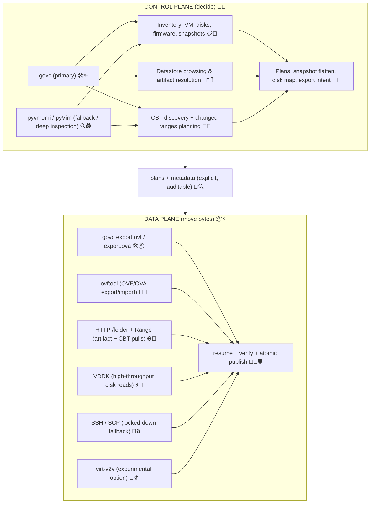

# vmdk2kvm 🚀🔥
**VMware → KVM/QEMU Conversion, Repair, and Automation Toolkit** 💻🔧🛡️

`vmdk2kvm` is a production-oriented toolkit for migrating VMware virtual machines (VMDK / OVA / OVF / ESXi / vCenter) into **KVM/QEMU-bootable images** **without relying on boot-time luck**. 🎲❌🚫

This project exists to solve the problems that show up *after* a “successful” conversion:
* Broken boots 😵💥
* Unstable device naming 🔄⚠️
* Missing or misordered drivers 🛠️🚧
* Corrupted or misleading snapshot chains 📸🤔
* Windows guests that blue-screen on first KVM boot 💥🪟

This repository is intentionally **not** “click migrate and pray”. 🙏🚫😅 It is **convert, repair, validate — and make it repeatable**. 🔄✅🔁

---
## Table of Contents 📋✨
1. Scope and Non-Goals 🔍❓
2. Design Principles 🛡️📜
3. Supported Inputs and Execution Modes 📥🔌
4. Pipeline Model 🛤️🚆
5. Control-Plane vs Data-Plane (vSphere, govc, OVF/OVA Exports, VDDK, HTTP, SSH) ⚙️🌐
6. Linux Fixes 🐧🔧
7. Windows Handling 🪟🛠️
8. Snapshots and Flattening 📸📏
9. Output Formats and Validation 📤✅
10. YAML Configuration Model 📄🗂️
11. Multi-VM and Batch Processing 📦🔄
12. Live-Fix Mode (SSH) 🔴🌐
13. ESXi and vSphere Integration 🌐🔗
14. virt-v2v Integration Strategy (Experimental) 🧪⚗️
15. Safety Mechanisms 🛡️🚨
16. Daemon Mode and Automation 🤖🔄
17. Testing and Verification ✅🧪
18. Failure Modes and Troubleshooting 🛠️⚠️
19. When Not to Use This Tool ⚠️🚫
20. Documentation Index 📚🔖
---

## 1. Scope and Non-Goals 🔍❓
### What This Tool **Does** ✅👍
* Converts VMware disks into KVM-usable formats 🔄💿
* Repairs Linux and Windows guests **offline** 🔧🛑
* Applies selected Linux fixes **live over SSH** 🌐🔴
* Stabilizes storage and network identifiers across hypervisors 📍🔗
* Injects Windows VirtIO drivers safely (**storage first, always**) 🛡️🚀
* Flattens VMware snapshot chains deterministically 📸📏
* Enables repeatable, automatable migrations via mergeable YAML 🔄🤖
* Validates results using libvirt / QEMU smoke tests 🔥✅

### What This Tool **Does Not** ❌🚫
* No GUI wizard 🧙‍♂️🚫
* No cloud importer ☁️🚫
* No promise of zero-touch Windows fixes 🤖🚫
* No attempt to hide complexity 🕵️‍♂️🚫

If you want *fast over correct*, this repo will argue with you — politely, and with logs. 📜😊🤝

---
## 2. Design Principles 🛡️📜
1. Boot failures are configuration problems, not copy problems 💥🔧🛠️
2. Device naming must survive hypervisor changes 🔄🛡️
3. Snapshot chains lie unless flattened or verified 📸🤥🚫
4. Windows storage must be **BOOT_START** before first KVM boot 🪟🚀🔥
5. Every destructive step needs a safe mode 🛡️⚠️
6. Configurations must be replayable 🔄🔁
7. Control-plane and data-plane must never be mixed ⚠️🚫

These rules are enforced structurally, not by convention. 🏗️💪

---
## 3. Supported Inputs and Execution Modes 📥🔌
### Offline / Local 📁🖥️
* Descriptor VMDK 📄🔍
* Monolithic VMDK 🧱💾
* Multi-extent snapshot chains 📸🔗

### Remote 🌐📡
* ESXi over SSH / SCP 🔑🔒
* Recursive snapshot fetch 📸🔄

### Archives 📦🗃️
* OVA 📦🔥
* OVF + extracted disks 📂💿

### Live Systems 🔴💻
* SSH access to running Linux guests (**live-fix mode**) 🌐🔧

### API and CLI Based (vSphere) ⚙️🛠️
vCenter / ESXi via:
* **govc** (primary CLI control-plane) 🛠️✨
* pyvmomi / pyVim (API fallback and deep inspection) 🔍🕵️

Used for:
* Inventory 📋🔍
* Snapshot planning 📸📝
* CBT discovery 🔄🔎
* Datastore browsing 📂🗂️
* Artifact resolution 🗂️🔗

---
## 4. Pipeline Model 🛤️🚆
All execution modes map to a **single internal pipeline**:
```
FETCH 📥 → FLATTEN 📸 → INSPECT 🔍 → FIX 🛠️ → CONVERT 🔄 → VALIDATE ✅
```
Stages are optional. **Order is not.** 🚫🔒

| Stage     | Purpose                          |
|-----------|----------------------------------|
| FETCH    | Obtain disks and metadata 📥💾   |
| FLATTEN  | Collapse snapshot chains 📸📏    |
| INSPECT  | Detect OS, layout, firmware 🔍🖥️|
| FIX      | Apply deterministic repairs 🛠️🔧|
| CONVERT  | Produce qcow2 / raw / etc 🔄💿   |
| VALIDATE | Boot-test and verify ✅🔥        |

The pipeline is explicit, inspectable, and restart-safe. 🔄🛡️💪

---
## 5. Control-Plane vs Data-Plane ⚙️🌐
This separation is the **spine** of `vmdk2kvm`. 🦴🔥

- **Control-Plane** decides *what exists* and *what should happen*. 🧠🤔
- **Data-Plane** moves *bytes* and produces *artifacts*. 📦💨

If you mix them, you get “it worked once” migrations. 🎲😩 If you separate them, you get repeatable ones. 🔄✅



### The Rule 📜🔒
* Control-plane **never** moves bulk data. 🚫💾
* Data-plane **never** makes inventory decisions. 🚫📋

The “bridge” between them is always **explicit plans + metadata** (never implicit guesses). 🌉🔗

---
### 5.1 Control-Plane Responsibilities (govc-First) 🧠🛠️
`govc` is treated as a **first-class control-plane**, not a convenience wrapper. 🛠️✨🔥

Used for:
* VM discovery (name, UUID, MoRef) 🔍🖥️
* Disk inventory + backing path resolution (datastore paths, controllers, device keys) 📂💿
* Snapshot tree inspection + flatten planning 📸🌳
* CBT discovery + changed-range planning 🔄📏
* Datastore browsing and folder artifact enumeration 📂🗂️
* Safety checks (power state, attached ISOs, device layout) 🛡️⚠️

`pyvmomi` remains available when:
* API-only fields are required 🔑🔒
* Deeper object-graph traversal is needed 🌳🔍
* govc output shapes aren’t sufficient for a specific edge case ⚠️🤔

Control-plane output is **a plan**: “export this VM, from this source, using these disks, with these safety edits, into these artifacts.” 📝🚀

---
### 5.2 Data-Plane Transports (Byte-Moving Only) 📦⚡
The data-plane answers one question: **How do bytes move safely, reproducibly, and restartably?** ⚡🔄🛡️

Supported transports:
#### A) Managed vSphere Exports (Artifact-First) 📦✨
* **govc `export.ovf` / `export.ova`** — vSphere-managed export flow. 🛠️🚀
  * Best when you want a clean **OVF/OVA artifact boundary**. ✨🔗
  * `export.ova` = single tarball convenience 📦💼
  * `export.ovf` = directory layout (OVF + VMDKs) that’s friendlier for large disks and partial re-runs 📂🔄
* **ovftool** — VMware/Broadcom’s OVF/OVA workhorse. 🔧💪
  * Useful when you need ovftool’s compatibility quirks, import/export symmetry, or vendor-specific flags. ⚙️🔄
  * Treated as data-plane because it primarily **produces artifacts** (OVF/OVA + disks). 📦💾

#### B) Raw Pulls (Fast, Surgical, Resumable) ⚡🔪
* **HTTP `/folder` + Range** — deterministic artifact downloads and CBT-driven incremental pulls. 🌐📥
* **VDDK** — high-throughput disk reads when you want speed and you can satisfy VDDK runtime + transport constraints. 🚀⚡
* **SSH / SCP** — fallback for constrained environments. 🔑🔒

#### C) Guest-Aware Conversion (Experimental Option) 🧪⚗️
* **virt-v2v** — available as an optional integration path, but **not the core philosophy** of this project.
  * Marked experimental because it can be great in the happy path, but it’s not the foundation of the “repair + determinism” model here. 🔄🛡️

All of these routes feed the same downstream pipeline stages. 🛤️🚆

---
### 5.3 Export Choices: OVF vs OVA (And Why We Care) 📦🤔
Think of OVF/OVA as **packaging formats**, not “conversion”. 🎁🔄

* **OVA**: Single file; easy to move/store; harder to resume mid-stream; large reruns hurt. 📦🚀😩
* **OVF**: Directory of artifacts; easier partial retries; friendlier for inspection and selective reuse. 📂🔍🔄

In `vmdk2kvm` terms:
* Choose **OVA** when you want a portable, single-object handoff. 🎁💼
* Choose **OVF** when you want restartability, transparency, and large-disk practicality. 🔄✨

Both are still *data-plane outputs* that then feed **INSPECT → FIX → CONVERT → VALIDATE**. 🛤️🔧

---
### 5.4 Decision Matrix (Pragmatic, Not Dogmatic) 📊🔍
| Goal                                               | Preferred Method                          |
|----------------------------------------------------|-------------------------------------------|
| Inventory + Planning                               | govc 🛠️✨                                |
| Export as Artifacts (Simple)                       | govc export.ovf / export.ova 🛠️📦       |
| Export as Artifacts (Compat-Heavy / Special Flags) | ovftool 🔧⚙️                             |
| Download Specific Datastore Files                  | HTTP `/folder` 🌐📡                      |
| Fast Raw Disk Extraction                           | VDDK ⚡🚀                                |
| No vCenter Access / Restricted                     | SSH / SCP 🔑🔒                           |
| Incremental Sync                                   | CBT Plan (CP) + HTTP Range (DP) 🔄📥     |
| Guest-Aware Conversion                             | virt-v2v (Experimental Option) 🧪⚗️      |

---
### 5.5 Incremental Migration (CBT) Stays Honest 🔄🛡️
CBT usage is explicit and auditable:
```
CONTROL PLANE:
  govc / pyvmomi → changed block ranges 🛠️🔍📏
        ↓
DATA PLANE:
  HTTP Range GET → local patch application 🌐🔧
        ↓
VERIFY:
  size / range coverage / optional checksums ✅🔒
```
If CBT lies, the tool **flags it**. It does not pretend. 🚩⚠️

---
### 5.6 Resume, Integrity, and Checkpoints 🔄✅
All data-plane operations are built around recovery:
* Resumable transfers 🔄📥
* `.part → final` promotion (atomic publish) 📦🔥
* Size verification 📏✅
* Optional hashing 🔒🛡️
* Rerun safety (idempotent “skip if complete” semantics) ✅🔁

Same config in. Same result out. No roulette-wheel boots. 🎲❌🚫

---
## 6. Linux Fixes 🐧🔧
* `/etc/fstab` rewrite (`UUID=` / `PARTUUID=` preferred) 📄🔄
* GRUB root stabilization (BIOS + UEFI) 🔄🛡️
* initramfs regeneration (distro-aware) ⚙️🔧
* Network cleanup (MAC pinning, VMware artifacts) 🌐🧹

---
## 7. Windows Handling 🪟🛠️
Windows is a **first-class citizen**, not an afterthought. ✨🪟

* VirtIO storage injected as **BOOT_START** 🚀🔥
* Offline registry and hive edits 🔧📝
* `CriticalDeviceDatabase` fixes 🛠️🔄
* BCD handling with backups 📂🛡️
* No blind binary patching 🚫🔒

---
## 8. Snapshots and Flattening 📸📏
* Recursive descriptor resolution 🔄🔍
* Parent-chain verification ✅🔗
* Flatten **before** conversion 🔄📸
* Atomic outputs 📦🔥

Snapshot flattening is strongly recommended. 👍💪

---
## 9. Output Formats and Validation 📤✅
**Formats** 📦💾
* qcow2 (recommended) 👍🚀
* raw 🧱💿
* vdi 📂🔄

**Validation** ✅🔥
* Checksums 🔒📏
* libvirt smoke boots 🔥🛡️
* Direct QEMU boots 🚀💻
* BIOS and UEFI ⚙️🖥️
* Headless supported 👻🔌

---
## 10. YAML Configuration Model 📄🗂️
YAML is treated as **code**:
* Mergeable 🔄🔗
* Reviewable 🔍👀
* Rerunnable 🔄🔁

```bash
--config base.yaml --config vm.yaml --config overrides.yaml
```

---
## 11–19 📦🔴🌐🧪🛡️🤖✅🛠️⚠️
* Batch processing 📦🔄
* Live-fix mode 🔴🔧
* ESXi + vSphere integration 🌐🔗
* virt-v2v coordination (experimental) 🧪⚗️
* Safety mechanisms 🛡️🚨
* Daemon and automation modes 🤖🔄
* Testing and failure analysis ✅🧪
* Explicit non-goals ⚠️🚫

---
## 20. Documentation Index 📚🔖
All detailed documentation, workflows, examples, and references live here:  
👉 **[https://github.com/ssahani/vmdk2kvm/tree/main/docs](https://github.com/ssahani/vmdk2kvm/tree/main/docs)** 📂🔍

---
**Convert with Intent. Repair with Evidence. Boot Without Luck.** 🚀🔧✅💥
