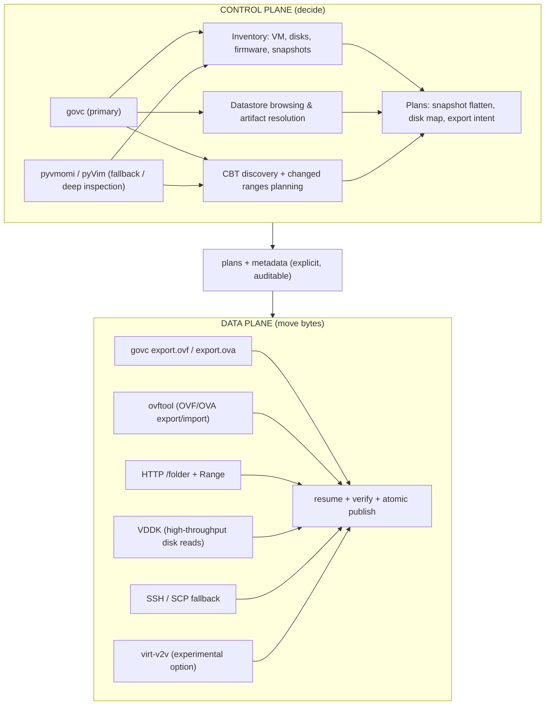

# hyper2kvm 🚀🔥

[](https://www.gnu.org/licenses/lgpl-3.0)
[](https://github.com/ssahani/hyper2kvm/stargazers/)

**Hypervisor → KVM/QEMU Conversion, Repair, and Automation Toolkit**

`hyper2kvm` is a production-oriented toolkit for migrating virtual machines  
from **multiple hypervisors and disk ecosystems**  
(VMware, Hyper-V, cloud images, raw artifacts, physical exports)  
into **KVM/QEMU-bootable systems** — **without relying on boot-time luck**.

KVM/QEMU is treated as the **target truth**.  
Everything else is an input dialect.

This project exists to solve the problems that show up *after* a “successful” conversion:

- Broken boots  
- Unstable device naming  
- Missing or misordered drivers  
- Corrupted or misleading snapshot chains  
- Windows guests that blue-screen on first KVM boot  
- Cloud images that assume hardware you don’t have  

This repository is intentionally **not** “click migrate and pray”.  
It is **convert, repair, validate — and make it repeatable**.

---

## Table of Contents
1. Scope and Non-Goals  
2. Design Principles  
3. Supported Inputs and Execution Modes  
4. Pipeline Model  
5. Control-Plane vs Data-Plane  
6. Linux Fixes  
7. Windows Handling  
8. Snapshots and Flattening  
9. Output Formats and Validation  
10. YAML Configuration Model  
11. Multi-VM and Batch Processing  
12. Live-Fix Mode (SSH)  
13. ESXi and vSphere Integration  
14. virt-v2v Integration Strategy (Experimental)  
15. Safety Mechanisms  
16. Daemon Mode and Automation  
17. Testing and Verification  
18. Failure Modes and Troubleshooting  
19. When Not to Use This Tool  
20. Documentation Index  

---

## 1. Scope and Non-Goals

### What This Tool **Does**
- Converts hypervisor disks into KVM-usable formats
- Repairs Linux and Windows guests **offline**
- Applies selected Linux fixes **live over SSH**
- Stabilizes storage and network identifiers across hypervisors
- Injects Windows VirtIO drivers safely (**storage first, always**)
- Uses a **two-phase Windows boot strategy** (SATA bootstrap → VirtIO final)
- Flattens snapshot chains deterministically
- Enables repeatable, automatable migrations via mergeable YAML
- Validates results using libvirt / QEMU smoke tests

While VMware remains the deepest and most battle-tested integration,  
`hyper2kvm` is intentionally **disk-centric**, not platform-centric.

If it can be reduced to **disks + metadata**, it can enter the pipeline.

### What This Tool **Does Not**
- No GUI wizard  
- No cloud lifecycle orchestration  
- No promise of zero-touch Windows fixes  
- No attempt to hide complexity  
- No hypervisor emulation  

If you want *fast over correct*, this repo will argue with you — politely, and with logs.

---

## 2. Design Principles
1. Boot failures are configuration problems, not copy problems  
2. Device naming must survive hypervisor changes  
3. Snapshot chains lie unless flattened or verified  
4. Windows storage must be **BOOT_START** before first KVM boot  
5. Every destructive step needs a safe mode  
6. Configurations must be replayable  
7. Control-plane and data-plane must never be mixed  

These rules are enforced structurally, not by convention.

---

## 3. Supported Inputs and Execution Modes

### Hypervisor-Agnostic by Design

`hyper2kvm` is **not a VMware-only tool**.

VMware happens to be the most deeply integrated source today because it is:
- Common in enterprises
- Snapshot-heavy
- Full of sharp edges

Architecturally, **hyper2kvm does not care about hypervisors**.  
It cares about:

- Disks
- Firmware assumptions
- Boot chains
- Drivers
- Metadata quality

Any platform that can ultimately produce **block devices + minimal metadata**
can be migrated.

```mermaid
flowchart LR
  HV1[VMware]
  HV2[Hyper-V]
  HV3[Cloud / AMI]
  HV4[Physical / Raw]
  HV5[Other Hypervisors]

  HV1 --> D[Disks + Metadata]
  HV2 --> D
  HV3 --> D
  HV4 --> D
  HV5 --> D

  D --> P[hyper2kvm Pipeline]
  P --> K[KVM / QEMU]
````

The moment disks are available, **all inputs converge**.

---

### Primary: VMware (Deep Integration)

* Descriptor VMDK
* Monolithic VMDK
* Multi-extent snapshot chains
* OVA
* OVF + extracted disks
* ESXi over SSH / SCP
* vCenter / ESXi via:

  * **govc** (primary control-plane)
  * **pyvmomi / pyVim** (fallback and deep inspection)

Used for:

* Inventory
* Snapshot planning
* CBT discovery
* Datastore browsing
* Artifact resolution

This is the most mature path in `hyper2kvm`.

---

### Hyper-V / Microsoft Disk Formats (Disk-Level)

Supported as **artifact inputs**, without Hyper-V APIs:

* VHD
* VHDX

Handled via offline inspection, repair, and deterministic driver transitions.

---

### Cloud Images / AMIs (Artifact-Level)

Supported once reduced to disks:

* AWS AMI / EBS snapshots (exported to raw / qcow2)
* Generic cloud images

Fixes include:

* NVMe vs virtio assumptions
* initramfs completeness
* Network configs bound to cloud metadata
* Bootloader defaults that fail off-cloud

No cloud lifecycle or IAM handling is included.

---

### Generic Disk Artifacts

Any block-attachable format:

* raw
* qcow2
* vdi
* vmdk
* vhd / vhdx

Once inside, all inputs are treated equally.

---

## 4. Pipeline Model

All execution modes map to a single internal pipeline:

```
FETCH → FLATTEN → INSPECT → FIX → CONVERT → VALIDATE
```

Stages are optional. **Order is not.**

| Stage    | Purpose                     |
| -------- | --------------------------- |
| FETCH    | Obtain disks and metadata   |
| FLATTEN  | Collapse snapshot chains    |
| INSPECT  | Detect OS, layout, firmware |
| FIX      | Apply deterministic repairs |
| CONVERT  | Produce qcow2 / raw / etc   |
| VALIDATE | Boot-test and verify        |

The pipeline is explicit, inspectable, and restart-safe.

---

## 5. Control-Plane vs Data-Plane (Architecture)

This separation is the **spine** of `hyper2kvm`.

* **Control-Plane** decides *what exists* and *what should happen*
* **Data-Plane** moves bytes and produces artifacts

If you mix them, you get “it worked once” migrations.
If you separate them, you get repeatable ones.



**Rule**

* Control-plane never moves bulk data
* Data-plane never makes inventory decisions

The bridge is always **explicit plans + metadata**.

---

## 6. Linux Fixes

* `/etc/fstab` rewrite (`UUID=` / `PARTUUID=` preferred)
* GRUB root stabilization (BIOS + UEFI)
* initramfs regeneration (distro-aware)
* Network cleanup (MAC pinning, hypervisor artifacts)

---

## 7. Windows Handling

Windows is a **first-class citizen**.

* VirtIO storage injected as **BOOT_START**
* Offline registry and hive edits
* `CriticalDeviceDatabase` fixes
* BCD handling with backups
* Two-phase boot: SATA bootstrap → VirtIO final
* Driver plans are **data-driven** (JSON/YAML)

No blind binary patching. Everything is logged and reversible.

---

## 8. Snapshots and Flattening

* Recursive descriptor resolution
* Parent-chain verification
* Flatten **before** conversion
* Atomic outputs

---

## 9. Output Formats and Validation

**Formats**

* qcow2 (recommended)
* raw
* vdi

**Validation**

* Checksums
* libvirt smoke boots
* Direct QEMU boots
* BIOS and UEFI
* Headless supported

---

## 10. YAML Configuration Model

YAML is treated as **code**:

* Mergeable
* Reviewable
* Rerunnable

```bash
--config base.yaml --config vm.yaml --config overrides.yaml
```

---

## 11–19. Advanced Topics

* Batch processing
* Live-fix mode (SSH)
* ESXi and vSphere integration
* virt-v2v coordination (experimental, never default)
* Safety mechanisms
* Daemon and automation modes
* Testing and failure analysis
* Explicit non-goals

---

## 20. Documentation Index

All detailed documentation lives here:

👉 [https://github.com/ssahani/hyper2kvm/tree/main/docs](https://github.com/ssahani/hyper2kvm/tree/main/docs)

```
