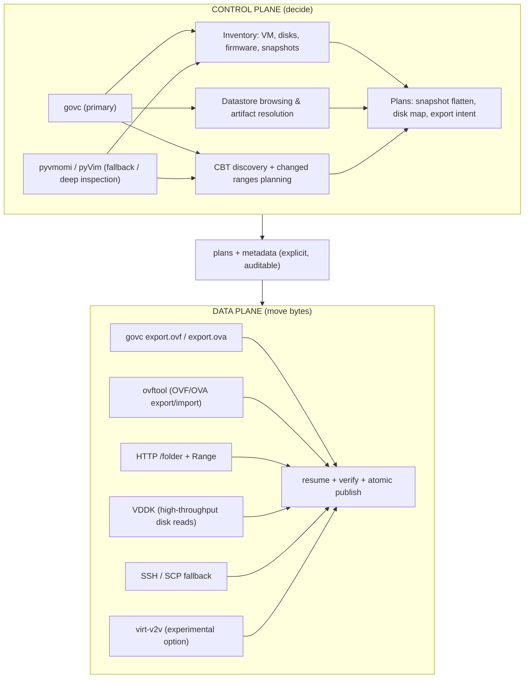

# hyper2kvm 🚀🔥

[](https://www.gnu.org/licenses/lgpl-3.0)
[](https://github.com/hyper2kvm/hyper2kvm/stargazers/)

**Hypervisor → KVM/QEMU Conversion, Repair, and Automation Toolkit**

`hyper2kvm` is a production-oriented toolkit for migrating virtual machines  
from **multiple hypervisors and disk ecosystems**  
(VMware, Hyper-V, cloud images, raw artifacts, physical exports)  
into **KVM/QEMU-bootable systems** — **without relying on boot-time luck**.

---

## Table of Contents
1. Scope and Non-Goals
2. Design Principles
3. Codebase Architecture
4. Supported Inputs and Execution Modes
5. Pipeline Model
6. Control-Plane vs Data-Plane
7. Linux Fixes
8. Windows Handling
9. Snapshots and Flattening
10. Output Formats and Validation
11. YAML Configuration Model
12. Multi-VM and Batch Processing
13. Live-Fix Mode (SSH)
14. ESXi and vSphere Integration
15. virt-v2v Integration Strategy (Experimental)
16. Safety Mechanisms
17. Daemon Mode and Automation
18. Testing and Verification
19. Failure Modes and Troubleshooting
20. When Not to Use This Tool
21. Documentation Index and References  

---

## 1. Scope and Non-Goals

### What This Tool **Does**
- Converts hypervisor disks into KVM-usable formats
- Repairs Linux and Windows guests **offline**
- Applies selected Linux fixes **live over SSH**
- Stabilizes storage and network identifiers across hypervisors
- Injects Windows VirtIO drivers safely (**storage first, always**)
- Uses a **two-phase Windows boot strategy** (SATA bootstrap → VirtIO final) to guarantee driver activation
- Flattens snapshot chains deterministically
- Enables repeatable, automatable migrations via mergeable YAML
- Validates results using libvirt / QEMU smoke tests

While VMware remains the deepest and most battle-tested integration,  
`hyper2kvm` is intentionally **disk-centric**, not platform-centric.

If it can be reduced to **disks + metadata**, it can enter the pipeline.

---

## 2. Installation

### Quick Install

```bash
# 1. Install system dependencies (Ubuntu/Debian)
sudo apt-get install -y python3-guestfs libguestfs-tools qemu-utils

# 2. Install Python dependencies
pip install -r requirements.txt

# 3. Install hyper2kvm
pip install -e .
```

**Important:** `libguestfs` and `hivex` are system packages, NOT pip packages. They must be installed via your OS package manager (apt, dnf, zypper).

See [DEPENDENCIES.md](DEPENDENCIES.md) for detailed installation instructions for all Linux distributions.

---

## 3. Design Principles

`hyper2kvm` is built around a small set of non-negotiable principles:

* **Determinism over luck**  
  Every action should be repeatable, inspectable, and explainable.  
  If a migration “just happens to boot,” something is missing.

* **Disk-centric, not platform-centric**  
  Hypervisors are treated as *sources of disks and metadata*, not as sacred systems.

* **Control-plane separated from data-plane**  
  Decisions are made before bytes move.  
  Byte movers never guess.

* **Offline-first repairs**  
  Guests should boot correctly on first power-on in KVM, without emergency console work.

* **Explicit plans over implicit behavior**  
  Snapshot flattening, driver injection, and boot strategy are always planned, never inferred mid-flight.

* **Safety by default**  
  Backups, atomic writes, and reversible changes are standard—not optional.

These principles are enforced structurally, not by convention.

---

## 3. Codebase Architecture

`hyper2kvm` is organized into **14 logical packages** with clear separation of concerns, making it easy to navigate, extend, and maintain.

### Package Structure

```
hyper2kvm/
├── cli/
│   └── args/              # CLI argument parsing (6 modules)
│       ├── builder.py     # HelpFormatter + epilog builder
│       ├── groups.py      # 21 argument group builders
│       ├── validators.py  # 18 validation functions
│       ├── helpers.py     # Helper functions (_merged_*, _require, etc.)
│       ├── parser.py      # Main parser orchestration
│       └── __init__.py    # Package exports
│
├── config/                # YAML configuration loading and merging
│
├── converters/            # Format conversion
│   ├── extractors/        # Disk format extractors (4 modules)
│   │   ├── ami.py         # AWS AMI extraction (1,019 lines)
│   │   ├── ovf.py         # OVF/OVA handling (567 lines)
│   │   ├── raw.py         # RAW disk processing (646 lines)
│   │   └── vhd.py         # VHD/VHDX handling (669 lines)
│   └── qemu/              # QEMU conversion (1 module)
│       └── converter.py   # qemu-img wrapper (879 lines)
│
├── core/                  # Core utilities and logging
│
├── fixers/                # Guest OS repair modules
│   ├── bootloader/        # Bootloader fixes (2 modules)
│   │   ├── fixer.py       # Generic bootloader fixer (641 lines)
│   │   └── grub.py        # GRUB-specific fixes (1,102 lines)
│   ├── filesystem/        # Filesystem fixes (2 modules)
│   │   ├── fixer.py       # Filesystem repair (923 lines)
│   │   └── fstab.py       # /etc/fstab rewriting (178 lines)
│   ├── live/              # Live migration (SSH) (2 modules)
│   │   ├── mode.py        # Live-fix orchestrator
│   │   └── ssh_client.py  # SSH connection handling
│   ├── network/           # Network configuration fixes (6 modules)
│   │   ├── model.py       # Data models and enums (434 lines)
│   │   ├── discovery.py   # Config file discovery (362 lines)
│   │   ├── topology.py    # Topology graph building (417 lines)
│   │   ├── validation.py  # Post-fix validation (131 lines)
│   │   ├── backend.py     # Backend-specific fixers (859 lines)
│   │   └── core.py        # Main orchestrator (418 lines)
│   ├── offline/           # Offline helper utilities (5 modules)
│   │   ├── mount.py       # Disk mounting (566 lines)
│   │   ├── vmware_tools_remover.py  # VMware Tools cleanup (454 lines)
│   │   ├── fstab_crypttab_rewriter.py
│   │   ├── spec_converter.py
│   │   └── validation_manager.py
│   └── windows/           # Windows fixes (3-tier structure, 18 modules)
│       ├── registry/      # Registry manipulation (6 modules)
│       │   ├── base.py    # Base registry operations
│       │   ├── driver.py  # Driver registry edits
│       │   ├── bcd.py     # BCD handling
│       │   └── ...
│       └── virtio/        # VirtIO driver injection (7 modules)
│           ├── injector.py  # Driver injection orchestrator
│           ├── scanner.py   # Driver file discovery
│           └── ...
│
├── modes/                 # Operational modes
│   ├── inventory_mode.py  # VM inventory scanning (318 lines)
│   └── plan_mode.py       # Migration planning (161 lines)
│
├── orchestrator/          # Pipeline orchestration
│   ├── orchestrator.py    # Main pipeline coordinator (358 lines)
│   ├── disk_processor.py  # Disk processing (335 lines)
│   ├── vsphere_exporter.py # vSphere export (264 lines)
│   ├── virt_v2v_converter.py # virt-v2v integration (268 lines)
│   └── disk_discovery.py  # Disk discovery (247 lines)
│
└── vmware/                # VMware integration
    ├── clients/           # VMware API clients (3 modules)
    │   ├── client.py      # VMwareClient (vSphere API)
    │   ├── vddk_client.py # VDDK client (1,245 lines)
    │   └── govc_client.py # govc wrapper
    ├── transports/        # Download/export methods (8 modules)
    │   ├── http_client.py # HTTPS download with progress
    │   ├── ssh_client.py  # SSH/SCP fallback
    │   ├── ovftool_client.py  # ovftool wrapper
    │   ├── session_cookie.py  # vSphere session management
    │   └── ...
    ├── vsphere/           # vSphere-specific implementations (4 modules)
    │   ├── mode.py        # Main vSphere orchestrator (1,470 lines)
    │   ├── command.py     # vSphere CLI commands
    │   └── ...
    └── utils/             # VMware utilities (4 modules)
        ├── vmdk_parser.py # VMDK descriptor parsing
        ├── vmx_parser.py  # VMX file parsing
        └── ...
```

### Package Descriptions

#### `cli/args/`
**Purpose:** CLI argument parsing split into focused modules
- **builder.py** - Custom HelpFormatter and epilog generation
- **groups.py** - 21 functions adding argument groups (vsphere, OVF, AMI, etc.)
- **validators.py** - 18 validation functions for command-line arguments
- **helpers.py** - Utility functions for config merging and resolution
- **parser.py** - Main `build_parser()` and `parse_args_with_config()` orchestration

**Key Pattern:** Backward compatibility maintained via `__init__.py` re-exports

#### `converters/`
**Purpose:** Disk format conversion and extraction

**extractors/** - Format-specific extraction logic:
- **ami.py** - AWS AMI extraction with partition handling
- **ovf.py** - OVF/OVA parsing and disk extraction
- **raw.py** - RAW disk format processing
- **vhd.py** - VHD/VHDX extraction (Hyper-V disks)

**qemu/** - QEMU-based conversion:
- **converter.py** - qemu-img wrapper for format conversion (vmdk → qcow2, etc.)

#### `fixers/`
**Purpose:** Guest OS repair modules (Linux and Windows)

**bootloader/** - Bootloader repair:
- **fixer.py** - Generic bootloader detection and fixing
- **grub.py** - GRUB-specific fixes (BIOS and UEFI)

**filesystem/** - Filesystem repairs:
- **fixer.py** - Filesystem check and repair (fsck, etc.)
- **fstab.py** - `/etc/fstab` rewriting with UUID stabilization

**network/** - Network configuration fixes (7 backends supported):
- **model.py** - Data models (`NetworkConfig`, `FixLevel`, enums)
- **discovery.py** - Config file discovery across distros
- **topology.py** - Dependency graph building for interface renames
- **validation.py** - Post-fix validation
- **backend.py** - Backend-specific fixers (netplan, systemd-networkd, ifcfg-rh, etc.)
- **core.py** - Main `NetworkFixer` orchestrator

**offline/** - Offline repair utilities:
- **mount.py** - Disk mounting and inspection via libguestfs
- **vmware_tools_remover.py** - VMware Tools cleanup
- **fstab_crypttab_rewriter.py** - fstab/crypttab rewriting
- **spec_converter.py** - Device specifier conversion (LABEL → UUID)
- **validation_manager.py** - Validation orchestration

**windows/** - Windows-specific fixes (3-tier structure):
- **registry/** - Windows registry manipulation (6 modules)
  - `base.py` - Base registry operations
  - `driver.py` - Driver registry edits
  - `bcd.py` - BCD (Boot Configuration Database) handling
- **virtio/** - VirtIO driver injection (7 modules)
  - `injector.py` - Main driver injection orchestrator
  - `scanner.py` - Driver file discovery and validation

**live/** - Live migration over SSH:
- **mode.py** - Live-fix orchestrator (apply fixes to running VMs)
- **ssh_client.py** - SSH connection and command execution

#### `modes/`
**Purpose:** Operational modes (inventory, planning)
- **inventory_mode.py** - VM inventory scanning and risk assessment (318 lines)
- **plan_mode.py** - Migration planning and preview (161 lines)

**Note:** Both files are small, focused, and require no further refactoring.

#### `orchestrator/`
**Purpose:** Pipeline orchestration (FETCH → FLATTEN → FIX → CONVERT → VALIDATE)
- **orchestrator.py** - Main pipeline coordinator (358 lines)
- **disk_processor.py** - Disk processing logic (335 lines)
- **vsphere_exporter.py** - vSphere export coordination (264 lines)
- **virt_v2v_converter.py** - virt-v2v integration (268 lines)
- **disk_discovery.py** - Disk discovery and metadata extraction (247 lines)

#### `vmware/`
**Purpose:** VMware integration (vSphere, ESXi, govc, VDDK)

**clients/** - VMware API clients:
- **client.py** - Main VMwareClient (pyvmomi/pyVim wrapper)
- **vddk_client.py** - VDDK (VMware Virtual Disk Development Kit) client
- **govc_client.py** - govc CLI wrapper

**transports/** - Data-plane download/export methods:
- **http_client.py** - HTTPS download with progress and resume support
- **ssh_client.py** - SSH/SCP fallback transport
- **ovftool_client.py** - ovftool wrapper for OVF/OVA export
- **session_cookie.py** - vSphere session cookie management
- **vddk_transport.py** - VDDK-based disk export

**vsphere/** - vSphere-specific orchestration:
- **mode.py** - Main vSphere mode orchestrator (1,470 lines)
- **command.py** - vSphere CLI command implementations

**utils/** - VMware utilities:
- **vmdk_parser.py** - VMDK descriptor parsing
- **vmx_parser.py** - VMX configuration file parsing

### Import Patterns

#### Package-Level Imports (Recommended)
```python
# Network fixer
from hyper2kvm.fixers.network import NetworkFixer

# Converters
from hyper2kvm.converters.extractors import AMI, OVF, RAW, VHD
from hyper2kvm.converters.qemu import Convert

# VMware clients
from hyper2kvm.vmware.clients import VMwareClient
from hyper2kvm.vmware.transports import HTTPDownloadClient

# CLI args
from hyper2kvm.cli.args import build_parser, validate_args
```

#### Backward Compatibility (Still Works)
```python
# Old-style imports still work via wrapper modules
from hyper2kvm.fixers.network_fixer import NetworkFixer
from hyper2kvm.vmware.vmware_client import VMwareClient
from hyper2kvm.cli.argument_parser import build_parser
```

All modules maintain backward compatibility via wrapper files in original locations.

### Developer Guide

#### Where to Add New Functionality

**New network backend (e.g., Alpine Linux `interfaces` format):**
→ `fixers/network/backend.py` - Add new `fix_alpine_interfaces()` method

**New disk format extractor (e.g., Parallels `.pvm`):**
→ `converters/extractors/parallels.py` - Create new extractor class
→ `converters/extractors/__init__.py` - Export new class

**New VMware transport method (e.g., NFS datastore access):**
→ `vmware/transports/nfs_client.py` - Implement new transport
→ Update `vmware/vsphere/mode.py` to use new transport

**New Windows driver injection strategy:**
→ `fixers/windows/virtio/` - Add new injection module
→ Update `fixers/windows/virtio/injector.py` to orchestrate

**New CLI validation:**
→ `cli/args/validators.py` - Add new `_validate_*()` function
→ Update `cli/args/validators.py:validate_args()` to call it

#### Code Quality Standards

All modules follow these standards:
- **Type annotations:** 100% coverage in new code (network package standard)
- **Imports:** `from __future__ import annotations` for forward references
- **Dependencies:** Zero circular dependencies (enforced)
- **Docstrings:** Comprehensive module and function docstrings
- **Single Responsibility:** Each module has one clear purpose
- **Size limit:** Modules over 1,000 lines should be considered for splitting

### Architecture Highlights

**Zero Circular Dependencies:**
All packages have clean dependency graphs. The refactoring specifically eliminated circular dependencies by:
- Separating data models from business logic
- Using composition over inheritance
- Keeping interfaces in base modules

**Composition Over Inheritance:**
Rather than deep class hierarchies, modules use composition:
```python
# NetworkFixer composes specialized components
class NetworkFixer:
    def __init__(self):
        self.discovery = NetworkDiscovery()
        self.topology = NetworkTopology()
        self.validation = NetworkValidation()
        self.backend = NetworkFixersBackend()
```

**Backward Compatibility:**
All reorganizations maintain 100% backward compatibility via wrapper modules that re-export from new locations.

**Package Exports:**
Each package has an `__init__.py` that exports public APIs, allowing clean imports:
```python
# fixers/network/__init__.py
from .core import NetworkFixer
from .model import FixLevel, NetworkConfig, InterfaceType

__all__ = ["NetworkFixer", "FixLevel", "NetworkConfig", "InterfaceType"]
```

---

## 4. Supported Inputs and Execution Modes

### Hypervisor-Agnostic by Design

`hyper2kvm` is **not a VMware-only tool**.

VMware happens to be the most deeply integrated source today because it is:
- Common in enterprises
- Snapshot-heavy
- Full of sharp edges

Architecturally, **hyper2kvm does not care about hypervisors**.  
It cares about:

- Disks
- Firmware assumptions
- Boot chains
- Drivers
- Metadata quality

Any platform that can ultimately produce **block devices + minimal metadata**
can be migrated.

```mermaid
flowchart LR
  HV1[VMware]
  HV2[Hyper-V]
  HV3[Cloud / AMI]
  HV4[Physical / Raw]
  HV5[Other Hypervisors]

  HV1 --> D[Disks + Metadata]
  HV2 --> D
  HV3 --> D
  HV4 --> D
  HV5 --> D

  D --> P[hyper2kvm Pipeline]
  P --> K[KVM / QEMU]
````

The moment disks are available, **all inputs converge**.

---

### Primary: VMware (Deep Integration)

* Descriptor VMDK
* Monolithic VMDK
* Multi-extent snapshot chains
* OVA
* OVF + extracted disks
* ESXi over SSH / SCP
* vCenter / ESXi via:

  * **govc** (primary control-plane)
  * **pyvmomi / pyVim** (fallback and deep inspection)

Used for:

* Inventory
* Snapshot planning
* CBT discovery
* Datastore browsing
* Artifact resolution

This is the most mature path in `hyper2kvm`.

---

### Hyper-V / Microsoft Disk Formats (Disk-Level)

Supported as **artifact inputs**, without Hyper-V APIs:

* VHD
* VHDX

Handled via offline inspection, repair, and deterministic driver transitions.

---

### Cloud Images / AMIs (Artifact-Level)

Supported once reduced to disks:

* AWS AMI / EBS snapshots (exported to raw / qcow2)
* Generic cloud images

Fixes include:

* NVMe vs virtio assumptions
* initramfs completeness
* Network configs bound to cloud metadata
* Bootloader defaults that fail off-cloud

No cloud lifecycle or IAM handling is included.

---

### Generic Disk Artifacts

Any block-attachable format:

* raw
* qcow2
* vdi
* vmdk
* vhd / vhdx

Once inside, all inputs are treated equally.

---

## 5. Pipeline Model

All execution modes map to a single internal pipeline:

```
FETCH → FLATTEN → INSPECT → FIX → CONVERT → VALIDATE
```

Stages are optional. **Order is not.**

| Stage    | Purpose                     |
| -------- | --------------------------- |
| FETCH    | Obtain disks and metadata   |
| FLATTEN  | Collapse snapshot chains    |
| INSPECT  | Detect OS, layout, firmware |
| FIX      | Apply deterministic repairs |
| CONVERT  | Produce qcow2 / raw / etc   |
| VALIDATE | Boot-test and verify        |

The pipeline is explicit, inspectable, and restart-safe.

---

## 6. Control-Plane vs Data-Plane (Architecture)

This separation is the **spine** of `hyper2kvm`.

* **Control-Plane** decides *what exists* and *what should happen*
* **Data-Plane** moves bytes and produces artifacts

If you mix them, you get “it worked once” migrations.
If you separate them, you get repeatable ones.



**Rule**

* Control-plane never moves bulk data
* Data-plane never makes inventory decisions

The bridge is always **explicit plans + metadata**.

---

## 7. Linux Fixes

* `/etc/fstab` rewrite (`UUID=` / `PARTUUID=` preferred)
* GRUB root stabilization (BIOS + UEFI)
* initramfs regeneration (distro-aware)
* Network cleanup (MAC pinning, hypervisor artifacts)

---

## 8. Windows Handling

Windows is a **first-class citizen**.

* VirtIO storage injected as **BOOT_START**
* Offline registry and hive edits
* `CriticalDeviceDatabase` fixes
* BCD handling with backups
* Two-phase boot: SATA bootstrap → VirtIO final
* Driver plans are **data-driven** (JSON/YAML)

No blind binary patching. Everything is logged and reversible.

---

## 9. Snapshots and Flattening

* Recursive descriptor resolution
* Parent-chain verification
* Flatten **before** conversion
* Atomic outputs

---

## 10. Output Formats and Validation

**Formats**

* qcow2 (recommended)
* raw
* vdi

**Validation**

* Checksums
* libvirt smoke boots
* Direct QEMU boots
* BIOS and UEFI
* Headless supported

---

## 11. YAML Configuration Model

YAML is treated as **code**:

* Mergeable
* Reviewable
* Rerunnable

```bash
--config base.yaml --config vm.yaml --config overrides.yaml
```

---

## 12–20. Advanced Topics

* Batch processing
* Live-fix mode (SSH)
* ESXi and vSphere integration
* virt-v2v coordination (experimental, never default)
* Safety mechanisms
* Daemon and automation modes
* Testing and failure analysis
* Explicit non-goals

---

## 21. Documentation Index and References

All detailed documentation lives here:

👉 `docs/`
Direct link: [https://github.com/hyper2kvm/hyper2kvm/tree/main/docs](https://github.com/hyper2kvm/hyper2kvm/tree/main/docs)
