# hyper2kvm Daemon Mode

Comprehensive guide to running hyper2kvm in daemon/watch mode for automated VM conversions.

## Overview

Daemon mode monitors a directory for incoming VM disk files and automatically processes them through the conversion pipeline. This is ideal for:

- **Automated migration workflows** - Drop files in a directory, get converted VMs
- **Batch processing** - Process multiple VMs overnight without manual intervention
- **Integration pipelines** - Connect hyper2kvm with other tools (export → convert → deploy)
- **Production deployments** - Run as a systemd service with automatic restart

## How It Works

```mermaid
graph TB
    IncomingDir[Incoming Directory watch_dir<br/>/var/lib/hyper2kvm/queue/<br/><br/>User drops:<br/>• vm1.vmdk<br/>• vm2.ova<br/>• vm3.vhd]
    Daemon[hyper2kvm Daemon<br/><br/>1. Detects new file<br/>2. Queues for processing<br/>3. Runs full conversion pipeline:<br/>  - Extract/convert disk<br/>  - Fix fstab, initramfs, grub<br/>  - Convert to qcow2 optional<br/>  - Compress optional<br/>4. Outputs to: /var/lib/hyper2kvm/output/vm1/<br/>5. Archives source to: .processed/vm1.vmdk]
    OutputDir[Output Directory output_dir<br/>/var/lib/hyper2kvm/output/<br/><br/>vm1/<br/>├── vm1.qcow2<br/>├── domain.xml<br/>└── metadata.json<br/><br/>vm2/<br/>├── vm2.qcow2<br/>└── ...]

    IncomingDir -->|Watchdog monitors for new files<br/>filesystem events - instant detection| Daemon
    Daemon --> OutputDir

    style IncomingDir fill:#FF9800,stroke:#E65100,color:#fff
    style Daemon fill:#4CAF50,stroke:#2E7D32,color:#fff
    style OutputDir fill:#2196F3,stroke:#1565C0,color:#fff
```



## Supported File Types

The daemon automatically detects file types by extension:

| Extension | Type | Handled As |
|-----------|------|------------|
| `.vmdk` | VMware disk | `command: local` |
| `.ova` | OVF archive | `command: ova` |
| `.ovf` | OVF descriptor | `command: ovf` |
| `.vhd`, `.vhdx` | Hyper-V disk | `command: vhd` |
| `.raw`, `.img` | Raw disk image | `command: raw` |
| `.ami` | AWS AMI image | `command: ami` |

## Quick Start

### 1. Create Configuration

```bash
sudo mkdir -p /etc/hyper2kvm

cat > /tmp/daemon.yaml <<'EOF'
command: daemon
daemon: true

# Watch directory
watch_dir: /var/lib/hyper2kvm/queue

# Output directory
output_dir: /var/lib/hyper2kvm/output

# Working directory for temporary files
workdir: /var/lib/hyper2kvm/work

# Conversion options
flatten: true
out_format: qcow2
compress: true
enable_recovery: true

# Logging
log_file: /var/log/hyper2kvm/daemon.log
verbose: 1

# Guest OS fixes
fstab_mode: stabilize-all
regen_initramfs: true
EOF

sudo cp /tmp/daemon.yaml /etc/hyper2kvm/daemon.yaml
sudo chmod 640 /etc/hyper2kvm/daemon.yaml
```

### 2. Run Manually (Testing)

```bash
# Create directories
sudo mkdir -p /var/lib/hyper2kvm/{queue,output,work}
sudo mkdir -p /var/log/hyper2kvm

# Run daemon in foreground
sudo python3 -m hyper2kvm --config /etc/hyper2kvm/daemon.yaml

# You should see:
# 🚀 Starting daemon mode
# 👀 Watching: /var/lib/hyper2kvm/queue
# 📤 Output: /var/lib/hyper2kvm/output
# 👂 File system observer started
# ✅ Daemon ready
```

### 3. Test File Processing

In another terminal:

```bash
# Drop a test VMDK file
sudo cp /path/to/test.vmdk /var/lib/hyper2kvm/queue/

# Watch the daemon logs - it should automatically:
# 📥 New file queued: test.vmdk
# 🔄 Processing: test.vmdk
# ✅ Completed: test.vmdk

# Check output
ls -lh /var/lib/hyper2kvm/output/test/
# Should contain: test.qcow2, domain.xml, etc.

# Source file moved to archive
ls -lh /var/lib/hyper2kvm/queue/.processed/
# Should contain: test.vmdk
```

## Running as Systemd Service

### Method 1: Using Template Service

```bash
# Copy config
sudo cp /tmp/daemon.yaml /etc/hyper2kvm/production.yaml

# Create directories
sudo mkdir -p /var/lib/hyper2kvm/{queue,output,work}
sudo mkdir -p /var/log/hyper2kvm

# Copy systemd service file
sudo cp /path/to/hyper2kvm/systemd/hyper2kvm@.service /etc/systemd/system/

# Reload systemd
sudo systemctl daemon-reload

# Start service
sudo systemctl enable --now hyper2kvm@production.service

# Check status
sudo systemctl status hyper2kvm@production.service

# View logs
sudo journalctl -u hyper2kvm@production.service -f
```

### Method 2: Using Main Service

```bash
# Copy config as main config
sudo cp /tmp/daemon.yaml /etc/hyper2kvm/hyper2kvm.conf

# Copy service file
sudo cp /path/to/hyper2kvm/systemd/hyper2kvm.service /etc/systemd/system/

# Start service
sudo systemctl enable --now hyper2kvm.service

# Check status
sudo systemctl status hyper2kvm.service

# View logs
sudo journalctl -u hyper2kvm.service -f
```

## Advanced Configuration

### Running as Dedicated User

```bash
# Create hyper2kvm user
sudo useradd -r -s /sbin/nologin -d /var/lib/hyper2kvm \
    -c "hyper2kvm daemon" hyper2kvm

# Add to required groups
for group in qemu kvm libvirt disk; do
    if getent group "$group" >/dev/null; then
        sudo usermod -a -G "$group" hyper2kvm
    fi
done

# Set permissions
sudo chown -R hyper2kvm:hyper2kvm /var/lib/hyper2kvm
sudo chown -R hyper2kvm:hyper2kvm /var/log/hyper2kvm
sudo chown root:hyper2kvm /etc/hyper2kvm
sudo chmod 750 /etc/hyper2kvm
sudo chmod 640 /etc/hyper2kvm/*.yaml

# Update systemd service to use hyper2kvm user
# (already configured in the provided service files)
```

### Running as Root (if required)

Some operations may require root (e.g., libguestfs with certain options):

```bash
# Edit the service
sudo systemctl edit hyper2kvm.service

# Add:
[Service]
User=root
Group=root
ReadWritePaths=/var/lib/hyper2kvm /var/log/hyper2kvm /tmp
```

### Archive Processed Files

By default, successfully processed files are moved to `.processed/` subdirectory:

```yaml
command: daemon
daemon: true
watch_dir: /var/lib/hyper2kvm/queue

# After processing, files are moved to:
# /var/lib/hyper2kvm/queue/.processed/
```

To disable archiving, you can manually delete files from the watch directory after processing.

### Error Handling

Failed conversions are moved to `.errors/` subdirectory:

```bash
# Check failed conversions
ls -lh /var/lib/hyper2kvm/queue/.errors/

# View error logs
sudo journalctl -u hyper2kvm.service --since "1 hour ago" | grep -i error
```

## Configuration Examples

### Minimal Configuration

```yaml
command: daemon
daemon: true
watch_dir: /incoming
output_dir: /output
```

### Production Configuration

```yaml
command: daemon
daemon: true

# Directories
watch_dir: /var/lib/hyper2kvm/queue
output_dir: /var/lib/hyper2kvm/output
workdir: /var/lib/hyper2kvm/work

# Output format
flatten: true
out_format: qcow2
compress: true
compress_level: 6

# Recovery and reliability
enable_recovery: true
checksum: true

# Performance (for large VMs)
parallel_processing: true
v2v_parallel: true
v2v_concurrency: 2

# Guest OS fixes
fstab_mode: stabilize-all
regen_initramfs: true
update_grub: true

# Windows-specific
win_virtio: true
win_hyperv: true

# Logging
log_file: /var/log/hyper2kvm/daemon.log
verbose: 2

# Domain XML generation
emit_domain_xml: true
vm_memory: 4096
vm_vcpus: 2
vm_uefi: true
```

### High-Volume Processing

```yaml
command: daemon
daemon: true

watch_dir: /var/lib/hyper2kvm/queue
output_dir: /mnt/storage/converted-vms
workdir: /var/lib/hyper2kvm/work

# Use virt-v2v for faster conversions
use_v2v: true
v2v_parallel: true
v2v_concurrency: 4

# Skip time-consuming operations
fstab_mode: minimal
regen_initramfs: false

# Output settings
flatten: true
out_format: qcow2
compress: false  # Skip compression for speed

# Logging
verbose: 1
log_file: /var/log/hyper2kvm/high-volume.log
```

### Multi-Instance Setup

Run multiple daemon instances for different sources:

```bash
# vSphere migrations
cat > /etc/hyper2kvm/vsphere.yaml <<EOF
command: daemon
daemon: true
watch_dir: /var/lib/hyper2kvm/vsphere-queue
output_dir: /var/lib/hyper2kvm/vsphere-output
log_file: /var/log/hyper2kvm/vsphere.log
EOF

# Azure migrations
cat > /etc/hyper2kvm/azure.yaml <<EOF
command: daemon
daemon: true
watch_dir: /var/lib/hyper2kvm/azure-queue
output_dir: /var/lib/hyper2kvm/azure-output
log_file: /var/log/hyper2kvm/azure.log
EOF

# Hyper-V migrations
cat > /etc/hyper2kvm/hyperv.yaml <<EOF
command: daemon
daemon: true
watch_dir: /var/lib/hyper2kvm/hyperv-queue
output_dir: /var/lib/hyper2kvm/hyperv-output
log_file: /var/log/hyper2kvm/hyperv.log
EOF

# Start all instances
sudo systemctl enable --now hyper2kvm@vsphere.service
sudo systemctl enable --now hyper2kvm@azure.service
sudo systemctl enable --now hyper2kvm@hyperv.service
```

## Monitoring and Troubleshooting

### Check Service Status

```bash
# Service status
sudo systemctl status hyper2kvm.service

# Is it running?
sudo systemctl is-active hyper2kvm.service

# View recent logs
sudo journalctl -u hyper2kvm.service -n 50

# Follow logs in real-time
sudo journalctl -u hyper2kvm.service -f

# View logs from last hour
sudo journalctl -u hyper2kvm.service --since "1 hour ago"
```

### Debug Mode

```yaml
# Enable verbose logging
command: daemon
daemon: true
watch_dir: /incoming
output_dir: /output
verbose: 3  # Maximum verbosity
```

### Common Issues

#### 1. Daemon Exits Immediately

```bash
# Check logs for errors
sudo journalctl -u hyper2kvm.service --since "5 minutes ago"

# Common causes:
# - Missing watch_dir or output_dir
# - Permission denied
# - Invalid configuration
```

#### 2. Files Not Being Processed

```bash
# Check if daemon is watching the right directory
sudo journalctl -u hyper2kvm.service | grep "Watching:"

# Check file permissions
ls -lh /var/lib/hyper2kvm/queue/

# Check if files have supported extensions
ls -lh /var/lib/hyper2kvm/queue/*.{vmdk,ova,vhd,raw,img,ami}
```

#### 3. Conversions Failing

```bash
# Check error directory
ls -lh /var/lib/hyper2kvm/queue/.errors/

# View detailed error logs
sudo journalctl -u hyper2kvm.service | grep -A 20 "Failed to process"

# Check disk space
df -h /var/lib/hyper2kvm
```

#### 4. Permission Errors

```bash
# If running as hyper2kvm user, ensure proper permissions
sudo chown -R hyper2kvm:hyper2kvm /var/lib/hyper2kvm
sudo chown -R hyper2kvm:hyper2kvm /var/log/hyper2kvm

# Or run as root (edit systemd service)
sudo systemctl edit hyper2kvm.service
# Add: User=root, Group=root
```

## Performance Tuning

### For Large VMs (100GB+)

```yaml
command: daemon
daemon: true

# Use direct I/O
use_v2v: true

# Enable parallel processing
parallel_processing: true
v2v_concurrency: 2

# Skip compression (do later if needed)
compress: false

# Increase systemd limits
# Edit /etc/systemd/system/hyper2kvm.service:
# MemoryMax=16G
# CPUQuota=400%
```

### For Many Small VMs

```yaml
command: daemon
daemon: true

# Enable compression to save space
compress: true
compress_level: 6

# Parallel processing
parallel_processing: true

# Faster guest OS fixes
fstab_mode: minimal
regen_initramfs: true
```

## Integration Examples

### With vSphere Export

```bash
# Export from vSphere using hyper2kvmd
curl -X POST http://localhost:8080/jobs/submit -H "Content-Type: application/json" -d '{
  "vm_path": "/datacenter/vm/my-vm",
  "output_path": "/var/lib/hyper2kvm/queue"
}'

# hyper2kvm daemon automatically picks up the exported files
# and converts them to qcow2
```

### With Cron Job

```bash
# /etc/cron.d/vm-export
# Export VMs daily at 2 AM and convert them
0 2 * * * root /usr/local/bin/export-vms.sh && \
  cp /exports/*.vmdk /var/lib/hyper2kvm/queue/
```

### With CI/CD Pipeline

```yaml
# .gitlab-ci.yml
migrate-vms:
  stage: migrate
  script:
    - scp vm-exports/*.ova migration-server:/var/lib/hyper2kvm/queue/
    - ssh migration-server 'systemctl is-active hyper2kvm.service'
    - ./wait-for-conversion.sh
  artifacts:
    paths:
      - /var/lib/hyper2kvm/output/
```

## Security Considerations

### Filesystem Permissions

```bash
# Lock down config directory
sudo chmod 750 /etc/hyper2kvm
sudo chmod 640 /etc/hyper2kvm/*.yaml

# Protect work directories
sudo chmod 750 /var/lib/hyper2kvm
sudo chmod 750 /var/log/hyper2kvm
```

### Systemd Hardening

The provided service files include security hardening:

```ini
[Service]
# Security hardening
NoNewPrivileges=true
PrivateTmp=true
ProtectSystem=strict
ProtectHome=true
ReadWritePaths=/var/lib/hyper2kvm /var/log/hyper2kvm

# Resource limits
MemoryMax=8G
CPUQuota=400%
TasksMax=200
```

### Network Isolation

```bash
# If daemon doesn't need network access:
sudo systemctl edit hyper2kvm.service

[Service]
PrivateNetwork=true
```

## Stopping the Daemon

### Graceful Shutdown

```bash
# Stop service (waits for current job to finish)
sudo systemctl stop hyper2kvm.service

# Or send SIGTERM
sudo kill -TERM $(pgrep -f "hyper2kvm.*daemon")
```

### Force Stop

```bash
# Force stop (kills immediately)
sudo systemctl kill -s SIGKILL hyper2kvm.service
```

## See Also

- [YAML Configuration Examples](05-YAML-Examples.md#6-daemon-mode-watch-a-directory-and-auto-convert)
- [Systemd Service Units](../systemd/README.md)
- [hyper2kvm Main Documentation](../README.md)
- [Integration with hypervisord](https://github.com/ssahani/hypersdk)
