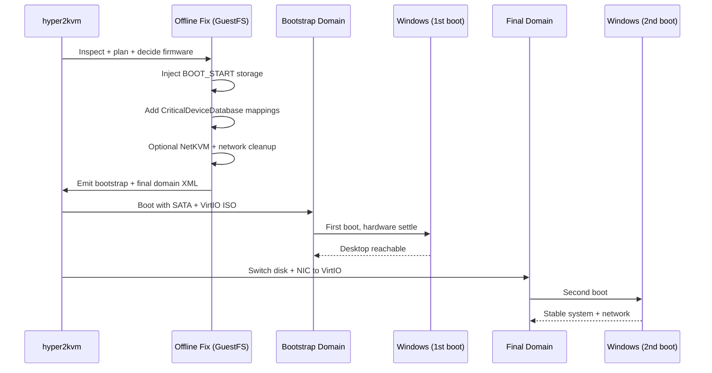
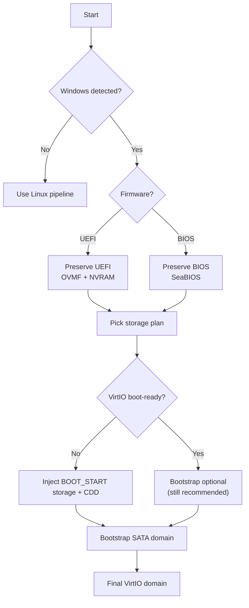

# Windows Boot Cycle (hyper2kvm) ➡➡

This document explains **how hyper2kvm makes Windows reliably boot on KVM/QEMU** after coming from *any* hypervisor (VMware, Hyper-V, cloud images, raw disks).

The core idea is simple:

> **Windows storage must be BOOT_START before the first KVM boot.**
> Network can wait. Storage cannot.

We implement a **two-phase boot cycle** to avoid the classic failure mode:

*  `INACCESSIBLE_BOOT_DEVICE` BSOD (VirtIO storage not ready at boot)

Instead we do:

*  Phase A: **Bootstrap** with SATA/IDE (safe, almost always boots)
*  Phase B: **Finalize** with VirtIO (fast, correct, production)

---

## Why Windows fails after hypervisor migration

Windows ties boot to:

* storage controller type (IDE / SATA / SCSI / VirtIO / NVMe)
* boot-critical driver startup type (**BOOT_START**)
* `CriticalDeviceDatabase` mappings (PNP IDs → service)
* BCD entries + firmware mode (BIOS vs UEFI)

When you change hypervisors, you change:

* controllers
* PNP IDs
* device paths
* sometimes firmware assumptions

So Windows boots fine on VMware… then faceplants on VirtIO.

---

## The Windows Boot Cycle (2-Phase)


```mermaid
flowchart TB
  A["Input Disks + Metadata<br/>(VMware / Hyper-V / Cloud / Raw)"]
    --> B["INSPECT Windows<br/>Detect firmware, boot disk, OS build"]

  B --> C["PLAN Fix<br/>Pick drivers + bootstrap strategy"]
  C --> D["OFFLINE FIX (GuestFS)<br/>Mount volumes, load hives"]

  D --> E["Inject VirtIO STORAGE<br/>Set BOOT_START"]
  E --> F["CriticalDeviceDatabase<br/>PNP ID → service"]

  F --> G["Optional: Inject NetKVM"]
  G --> H["Optional: Network cleanup"]

  H --> I["BCD sanity checks<br/>Backup before changes"]

  I --> J["Bootstrap Domain XML<br/>SATA/IDE + VirtIO ISO"]
  J --> K["First KVM Boot<br/>Hardware enumeration"]

  K --> L["Final Domain XML<br/>VirtIO disk + NIC"]
  L --> M["Second Boot<br/>Production profile"]

  M --> N["VALIDATE<br/>Smoke tests + logs"]
````

---

## Phase A: Offline Fix + Bootstrap Boot (SATA)

### Goals

* Guarantee Windows can boot once under KVM
* Ensure VirtIO **storage** driver is BOOT_START-capable
* Keep all changes reversible and logged

---

### What we do offline

#### 1) Discover Windows layout

We locate (best effort):

* `WindowsRoot` (usually `C:\Windows`)
* system directory (usually `C:\Windows\System32`)
* registry hives:

  * `SYSTEM`
  * `SOFTWARE`
  * optional `BCD` (UEFI: `\EFI\Microsoft\Boot\BCD`)

---

#### 2) Prepare VirtIO driver plan (data-driven)

Drivers are selected using **JSON/YAML**, based on:

* Windows build bucket
* architecture (x64)
* target devices (storage first, network second)

This lets you:

* add vendors with custom PNP IDs
* update OS mappings without code changes
* support future Windows releases safely

---

#### 3) Inject storage driver (the sacred step)

We stage VirtIO storage drivers and ensure:

* service exists (`viostor` or `vioscsi`)
* startup type = **BOOT_START**
* required registry keys exist
* optional `Group` / `Tag` set correctly

This single step prevents:

*  `INACCESSIBLE_BOOT_DEVICE`

---

#### 4) Populate CriticalDeviceDatabase

We map PNP IDs like:

```
PCI\VEN_1AF4&DEV_1001
```

to the correct storage service so Windows binds the driver **early in boot**.

---

#### 5) Optional: Inject NetKVM (VirtIO network)

Network drivers are:

* injected offline (recommended)
* usually SYSTEM_START (safe)

This ensures the **second boot** has working networking.

---

#### 6) Optional: Network cleanup policies

Windows often carries:

* ghost NICs
* stale MAC-bound profiles
* static IPs tied to removed adapters

hyper2kvm applies **safe, explicit policies only**:

* remove stale adapter references
* preserve static IP if safely discoverable
* provide DHCP fallback if binding is unsafe
* avoid “new network every boot” loops

---

#### 7) BCD sanity checks + backups

We **do not blindly rewrite BCD**.

We:

* detect firmware mode (BIOS vs UEFI)
* verify boot partition layout
* back up BCD before touching it
* repair only when clearly broken

---

### Why the bootstrap domain uses SATA / IDE

Even with perfect driver injection, Windows benefits from one boot where it:

* enumerates new chipset devices
* finalizes driver installs
* stabilizes services

So the bootstrap domain uses:

* disk via **SATA or IDE**
* VirtIO driver ISO attached
* conservative machine profile

---

## Phase B: Finalize Boot (VirtIO)

After first boot succeeds:

* disk bus → **VirtIO**
* NIC model → **VirtIO**
* remove bootstrap-only devices
* keep firmware mode unchanged

This is the **production domain**.

---

### Mermaid: Bootstrap → Final switch



---

## Appendix: Minimal “Decision Rules”


