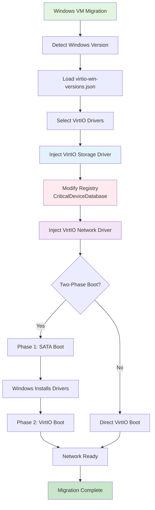

#  Windows Network & Driver Configuration in hyper2kvm

> **Declarative. Explicit. Boring (in the best way).**
> Windows conversions fail when networking and drivers are left to luck.
> hyper2kvm makes both **fully declarative** using **YAML + JSON**, with no hidden magic.

This document explains **how Windows networking and drivers are configured**, how **YAML references JSON**, and how everything fits into the larger hyper2kvm pipeline.

---

## Prerequisites

For Windows VM migration, you need:

- ✓ hyper2kvm installed ([Installation Guide](02-Installation.md))
- ✓ VirtIO drivers ISO downloaded
- ✓ Windows source VM disk (VMDK, VHD, etc.)
- ✓ Understanding of [Windows Boot Cycle](11-Windows-Boot-Cycle.md)


## Architecture Overview

### Windows Network Configuration Flow



### Key Components

- **JSON Database:** `virtio-win-versions.json` contains driver paths and compatibility
- **Registry Modification:** Adds VirtIO drivers to `CriticalDeviceDatabase`  
- **Two-Phase Boot:** SATA → VirtIO transition for compatibility
- **Driver Injection:** Offline modification before first boot


## Table of Contents

- [Design Philosophy](#design-philosophy)
- [📌 Where This Applies](#where-this-applies)
- [YAML → JSON: Network Override (Recommended)](#yaml-json-network-override-recommended)
  - [YAML configuration](#yaml-configuration)
  - [JSON payload (`windows-network.json`)](#json-payload-windows-networkjson)
  - [What happens internally](#what-happens-internally)
- [Inline Network JSON (Advanced / CI Friendly)](#inline-network-json-advanced-ci-friendly)
- [Network JSON Schema (Current)](#network-json-schema-current)
- [What Driver JSON Controls](#what-driver-json-controls)
- [YAML → JSON: Driver Metadata](#yaml-json-driver-metadata)
  - [YAML configuration](#yaml-configuration)
  - [JSON: Core VirtIO Metadata (`virtio-drivers.json`)](#json-core-virtio-metadata-virtio-driversjson)
- [🏭 Vendor / OEM Overrides (Optional)](#vendor-oem-overrides-optional)
  - [Vendor JSON (`virtio-vendors.json`)](#vendor-json-virtio-vendorsjson)
  - [YAML to activate vendor overlay](#yaml-to-activate-vendor-overlay)
- [Next Steps](#next-steps)
- [Getting Help](#getting-help)

---
##  Design Philosophy

hyper2kvm follows a strict separation of concerns:

| Layer | Responsibility              | Format |
| ----- | --------------------------- | ------ |
| YAML  | Orchestration & intent      | YAML   |
| JSON  | Stable structured knowledge | JSON   |
| Code  | Execution engine            | Python |

Why this matters:

* YAML stays readable and override-friendly
* JSON files can be versioned, validated, and reused
* Code never hard-codes policy or vendor quirks

---

## 📌 Where This Applies

These mechanisms apply when:

* The guest OS is **Windows**
* You are converting **VMware → KVM/QEMU**
* You care about:

  * Network configuration retention
  * Predictable driver availability
  * First-boot reliability

---

#  Windows Network Configuration (Retention & Overrides)

Windows networking is **not modified directly offline**.
Instead, hyper2kvm **stages a first-boot configuration** that is applied once Windows boots under KVM.

This avoids registry archaeology and matches how Windows actually wants to be configured.

---

##  YAML → JSON: Network Override (Recommended)

### YAML configuration

```yaml
command: local
vmdk: /images/windows.vmdk

windows: true

win_net_override: ./net/windows-network.json
```

### JSON payload (`windows-network.json`)

```json
{
  "schema": 1,
  "mode": "static",
  "static": {
    "address": "192.168.100.50/24",
    "gateway": "192.168.100.1",
    "dns_servers": ["10.0.0.53", "8.8.8.8"]
  }
}
```

### What happens internally

1. JSON is validated on the host
2. File is staged into the guest (example):

   ```
   C:\hyper2kvm\net\network_override.json
   ```
3. A first-boot helper applies it using:

   * `netsh`
   * PowerShell
   * or WMI (implementation-dependent)

After the first successful application, the override is **not re-applied**.

---

##  Inline Network JSON (Advanced / CI Friendly)

Useful when embedding everything into a single YAML file (systemd, CI, Ansible).

```yaml
win_net_json: >-
  {"schema":1,"mode":"dhcp",
   "dhcp":{"dns_servers":["10.0.0.53"]}}
```

Behavior:

* The JSON is **materialized into `workdir/`**
* Treated exactly like `win_net_override`
* File path takes precedence if both are present

---

##  Network JSON Schema (Current)

```json
{
  "schema": 1,
  "mode": "dhcp | static",
  "dhcp": {
    "dns_servers": ["x.x.x.x"]
  },
  "static": {
    "address": "IP/CIDR",
    "gateway": "IP",
    "dns_servers": ["IP", "IP"]
  }
}
```

---

# 🧰 Windows Driver Configuration (VirtIO + Vendors)

Driver handling is **explicit** and **data-driven**.

No guessing.
No OS-string hacks.
No hard-coded PNP IDs.

---

##  What Driver JSON Controls

* Which INF files are injected
* Which drivers are staged
* Which PNP IDs are enabled
* Which services are pre-registered
* Which Windows versions receive which drivers

---

##  YAML → JSON: Driver Metadata

### YAML configuration

```yaml
windows_drivers:
  virtio:
    metadata_json: ./drivers/virtio-drivers.json
```

---

### JSON: Core VirtIO Metadata (`virtio-drivers.json`)

```json
{
  "schema": 1,
  "default_os_bucket": "win11",

  "os_buckets": {
    "win11": { "min_build": 22000 },
    "win10": { "min_build": 10240, "max_build": 21999 },
    "win2019": { "min_build": 17763 },
    "win2022": { "min_build": 20348 }
  },

  "roles": {
    "storage_virtio_scsi": {
      "inf_globs": ["vioscsi\\\\**\\\\*.inf"],
      "pnp_ids": ["PCI\\\\VEN_1AF4&DEV_1004"]
    },
    "storage_virtio_blk": {
      "inf_globs": ["viostor\\\\**\\\\*.inf"],
      "pnp_ids": ["PCI\\\\VEN_1AF4&DEV_1001"]
    },
    "net_virtio": {
      "inf_globs": ["NetKVM\\\\**\\\\*.inf"],
      "pnp_ids": ["PCI\\\\VEN_1AF4&DEV_1000"]
    },
    "balloon": {
      "inf_globs": ["Balloon\\\\**\\\\*.inf"],
      "pnp_ids": ["PCI\\\\VEN_1AF4&DEV_1002"]
    },
    "rng": {
      "inf_globs": ["viorng\\\\**\\\\*.inf"],
      "pnp_ids": ["PCI\\\\VEN_1AF4&DEV_1005"]
    },
    "serial": {
      "inf_globs": ["vioserial\\\\**\\\\*.inf"],
      "pnp_ids": ["PCI\\\\VEN_1AF4&DEV_1003"]
    }
  }
}
```

---

## 🏭 Vendor / OEM Overrides (Optional)

Some vendors ship custom SUBSYS IDs.
These belong in **data**, not code.

### Vendor JSON (`virtio-vendors.json`)

```json
{
  "vendors": {
    "acme-oem": {
      "roles": {
        "net_virtio": {
          "pnp_ids": [
            "PCI\\\\VEN_1AF4&DEV_1000&SUBSYS_00000001",
            "PCI\\\\VEN_1AF4&DEV_1000&SUBSYS_12345678"
          ]
        }
      }
    }
  }
}
```

### YAML to activate vendor overlay

```yaml
windows_drivers:
  virtio:
    metadata_json: ./drivers/virtio-drivers.json
    vendor_overrides_json: ./drivers/virtio-vendors.json
    active_vendor: acme-oem
```

---

# 🧩 Full Windows Example (Everything Combined)

```yaml
command: local
vmdk: /images/windows.vmdk
output_dir: ./out

windows: true

#  Network configuration
win_net_override: ./net/windows-network.json

# 🧰 Driver metadata
windows_drivers:
  virtio:
    metadata_json: ./drivers/virtio-drivers.json
    vendor_overrides_json: ./drivers/virtio-vendors.json
    active_vendor: acme-oem

flatten: true
to_output: windows-kvm.qcow2
out_format: qcow2
compress: true
checksum: true
```

## Next Steps

For Windows migrations:

- **[Windows Boot Cycle](11-Windows-Boot-Cycle.md)** - Understanding Windows boot process
- **[Windows Troubleshooting](12-Windows-Troubleshooting.md)** - Common Windows issues
- **[Windows Networking](13-Windows-Networking.md)** - Network and driver configuration

## Getting Help

- [Troubleshooting Guide](90-Failure-Modes.md)
- [GitHub Issues](https://github.com/ssahani/hyper2kvm/issues)

