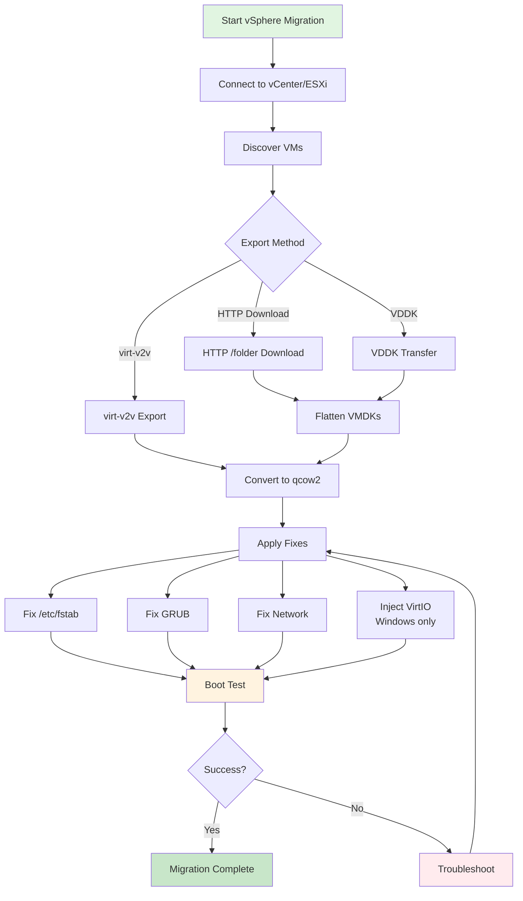

# vSphere → virt-v2v Export (Download Only) with hyper2kvm + pyvmomi (Control-plane) + virt-v2v/VDDK (Data-plane)

This document describes a **download-only export pipeline** that pulls a VM from **vCenter/vSphere** and exports its disks locally using **virt-v2v** (typically via **VDDK**).  
The key idea is:

- **pyvmomi** is used for **control-plane** (inventory, datacenter resolution, host-system compute path, optional snapshot hooks)
- **virt-v2v** is used for **data-plane** (actually moving disk data from vSphere to local qcow2/raw)
- **hyper2kvm** orchestrates this flow, but **does NOT run** its internal conversion/post-conversion stages (download-only mode)

---

## Migration Workflow

### vSphere to KVM Migration Flow



### Export Methods Comparison

| Method | Speed | Use Case | Requirements |
|--------|-------|----------|--------------|
| **virt-v2v** | Medium | Full conversion | virt-v2v installed |
| **HTTP Download** | Slow | Exact copy | vCenter access |
| **VDDK** | Fast | Large VMs | VDDK library |


## Table of Contents

- [What we did (high level)](#what-we-did-high-level)
  - [1) We configured credentials safely (no plaintext)](#1-we-configured-credentials-safely-no-plaintext)
  - [2) We enabled the virt-v2v export path](#2-we-enabled-the-virt-v2v-export-path)
  - [3) We pinned the VM and datacenter explicitly](#3-we-pinned-the-vm-and-datacenter-explicitly)
  - [4) We chose transport = VDDK and provided VDDK libdir](#4-we-chose-transport-vddk-and-provided-vddk-libdir)
  - [5) We kept export concurrency conservative](#5-we-kept-export-concurrency-conservative)
  - [6) We made it download-only (no extra conversion stages)](#6-we-made-it-download-only-no-extra-conversion-stages)
  - [7) We disabled smoke tests by default](#7-we-disabled-smoke-tests-by-default)
- [Run commands](#run-commands)
  - [List VM names (inventory)](#list-vm-names-inventory)
  - [Export/download VM (virt-v2v)](#exportdownload-vm-virt-v2v)
- [YAML configuration (download-only)](#yaml-configuration-download-only)
- [Output artifact](#output-artifact)
- [Troubleshooting notes (the “sharp edges”)](#troubleshooting-notes-the-sharp-edges)
  - [“Path … does not specify a host system”](#path-does-not-specify-a-host-system)
  - [VDDK libdir errors (libvixDiskLib.so not found)](#vddk-libdir-errors-libvixdisklibso-not-found)
  - [Thumbprint vs no_verify](#thumbprint-vs-no_verify)

---
## What we did (high level)

### 1) We configured credentials safely (no plaintext)
We set the vCenter password via an environment variable:

```bash
export VC_PASSWORD='test@1234'
````

The YAML references it via `vc_password_env: VC_PASSWORD` and also repeats it as `vs_password_env: VC_PASSWORD` for compatibility with code paths that still read `vs_*` fields.

### 2) We enabled the virt-v2v export path

We enabled the “export/download” flow:

* `command: vsphere`
* `vs_v2v: true`

This tells the orchestrator to take the **virt-v2v export route** rather than the internal VMDK conversion route.

### 3) We pinned the VM and datacenter explicitly

We targeted the VM:

* `vs_vm: esx8.0-rhel10.0beta-x86_64-efi`

And we specified the datacenter:

* `vs_datacenter: ha-datacenter`

(Your newer VMware client can also resolve datacenter automatically when configured, but explicit is good for stability.)

### 4) We chose transport = VDDK and provided VDDK libdir

We selected:

* `vs_transport: vddk`

And provided a VDDK root directory:

* `vs_vddk_libdir: /opt/vmware-vix-disklib-distrib`

Your improved code resolves/validates the real **libdir containing `libvixDiskLib.so*`** (e.g. `.../lib64`) automatically.

### 5) We kept export concurrency conservative

To reduce vCenter/VDDK stress and avoid “random” failures:

* `vs_v2v_concurrency: 1`

### 6) We made it download-only (no extra conversion stages)

We explicitly disabled any post-export conversion flow:

* `use_v2v: false`
* `post_v2v: false`

So the pipeline stops after **virt-v2v writes the local output**.

### 7) We disabled smoke tests by default

We left these off:

* `libvirt_test: false`
* `qemu_test: false`

You *can* enable them later once you decide the host test harness.

---

## Run commands

### List VM names (inventory)

```bash
export VC_PASSWORD='xxyyxx'
sudo -E ./hyper2kvm.py --config v2v-rhel10.yaml vsphere list_vm_names
```

### Export/download VM (virt-v2v)

Your CLI may expose this as an `export` / `v2v_export` / `run` style subcommand depending on your orchestrator.
The important part is: since `vs_v2v: true`, it will follow the virt-v2v export path.

Example (adapt to your subcommand naming):

```bash
export VC_PASSWORD='xxyyxxyxxyx'
sudo -E ./hyper2kvm.py --config v2v-rhel10.yaml vsphere export
```

---

## YAML configuration (download-only)

> Notes:
>
> * This YAML uses **pyvmomi** for control-plane and **virt-v2v** for data-plane.
> * It exports disks to `output_dir` in `out_format` (qcow2 by default).
> * It does NOT run internal conversion (`use_v2v:false`) and does NOT run post-v2v (`post_v2v:false`).

```yaml
# vSphere → virt-v2v export (download only)
# VM: esx8.0-rhel10.0beta-x86_64-efi
# Guest: RHEL 10.0 beta (EFI)
# Power state: poweredOff
#
# Run:
#   export VC_PASSWORD='test@1234'
#   sudo -E ./hyper2kvm.py --config v2v-rhel10.yaml vsphere list_vm_names
#   # (Orchestrator will still take the v2v-export path because vs_v2v:true)
#
# Notes:
#   - This YAML is “download/export only”: it uses pyvmomi for control-plane and virt-v2v for data-plane.
#   - hyper2kvm will export the VM disks to local output_dir as qcow2 (or raw if out_format is changed).
#   - It does NOT run internal conversion steps (use_v2v:false) and does NOT run post_v2v (post_v2v:false).
#   - If you enable smoke tests, ensure your host has libvirt/qemu/OVMF and that the image is compatible.

command: vsphere

# ------------------------------------------------------------------
# vCenter connection (pyvmomi control-plane)
# ------------------------------------------------------------------
vcenter: 192.168.73.42
vc_user: administrator@vsphere.local
vc_password_env: VC_PASSWORD
vc_insecure: true

# ------------------------------------------------------------------
# IMPORTANT: v2v-export hook credential aliases
# Some parts of the code look for vs_host/vs_user/vs_password(_env).
# Keep these in sync with the vc_* values above.
# ------------------------------------------------------------------
vs_host: 10.73.213.134
vs_user: administrator@vsphere.local
vs_password_env: VC_PASSWORD
# vs_password: ""   # avoid plaintext; prefer env

# ------------------------------------------------------------------
# Enable virt-v2v export path (data-plane via virt-v2v)
# ------------------------------------------------------------------
vs_v2v: true

# Which VM(s) to export
vs_vm: esx8.0-rhel10.0beta-x86_64-efi
# vs_vms: ["vm1", "vm2"]   # optional multi-export

# Datacenter (be explicit)
vs_datacenter: ha-datacenter

# Transport: vddk | ssh
vs_transport: vddk

# VDDK configuration (REQUIRED for vddk transport)
vs_vddk_libdir: /opt/vmware-vix-disklib-distrib
# vs_vddk_thumbprint: "AA:BB:CC:DD:..."   # optional; auto-computed if omitted (when verify enabled)
# vs_no_verify: true                      # alternative to thumbprint (less secure)
# vs_vddk_transports: "nbdssl:nbd"        # optional (advanced)

# Snapshot handling
vs_create_snapshot: false
# vs_snapshot_moref: snapshot-123         # only if exporting from an existing snapshot MoRef

# Safety: keep concurrency = 1
vs_v2v_concurrency: 1

# Extra virt-v2v flags (optional)
vs_v2v_extra_args:
  - "-v"
  - "-x"

# ------------------------------------------------------------------
# virt-v2v output (download/export artifact location)
# ------------------------------------------------------------------
output_dir: ./out/v2v/esx8.0-rhel10.0beta-x86_64-efi
out_format: qcow2
compress: true

# ------------------------------------------------------------------
# What happens AFTER v2v?
# DOWNLOAD-ONLY mode:
#   - do NOT run hyper2kvm’s internal conversion via v2v
#   - do NOT run post-v2v conversion
# ------------------------------------------------------------------
use_v2v: false
post_v2v: false

# ------------------------------------------------------------------
# Optional smoke testing AFTER export (disabled by default)
# ------------------------------------------------------------------
libvirt_test: false
qemu_test: false
uefi: true
memory: 2048
vcpus: 1
timeout: 90
headless: true

# Logging / reporting
verbose: 1
report: v2v-export-report.md
```

---

## Output artifact

After a successful export, you should have output under:

* `./out/v2v/esx8.0-rhel10.0beta-x86_64-efi/`

Typically this will include one or more exported disk images in qcow2 (and virt-v2v logs).

---

## Troubleshooting notes (the “sharp edges”)

### “Path … does not specify a host system”

This happens when the vpx path is cluster-only.
Your updated VMwareClient resolves **host-system compute paths**:

*  `host/<ClusterOrCompute>/<EsxHost>`
  instead of
*  cluster-only paths that libvirt ESX rejects

### VDDK libdir errors (libvixDiskLib.so not found)

If you pass the VDDK *root* and not the final `lib64/` directory, your improved resolver will search under it and find the real libdir.
If it still fails, check that `libvixDiskLib.so*` exists somewhere under the given path.

### Thumbprint vs no_verify

* Prefer thumbprint verification when possible (more secure).
* `vs_no_verify: true` is convenient but disables verification.
