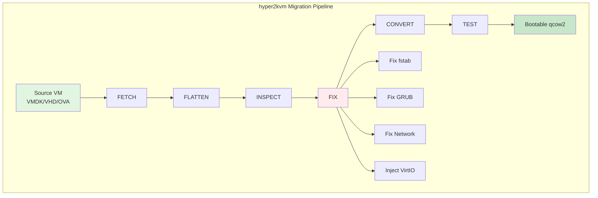

# hyper2kvm Documentation

Complete documentation for the hyper2kvm VM migration toolkit.

## Table of Contents

### Getting Started
- **[Quick Start Guide](03-Quick-Start.md)** - Get running in 5 minutes
- **[Installation](02-Installation.md)** - Detailed installation instructions
- **[CLI Reference](04-CLI-Reference.md)** - Complete command-line reference

### Core Concepts
- **[Architecture](01-Architecture.md)** - System design and components
- **[YAML Configuration](05-YAML-Examples.md)** - Configuration file reference

### Platform-Specific Guides
- **[Windows Migration](10-Windows-Guide.md)** - Windows VM conversion guide
- **[PhotonOS](21-Photon-OS.md)** - VMware PhotonOS migrations
- **[RHEL 10](20-RHEL-10.md)** - Red Hat Enterprise Linux 10
- **[Ubuntu 24.04](22-Ubuntu-24.04.md)** - Ubuntu migrations
- **[SUSE](23-SUSE.md)** - SUSE Linux conversions

### Advanced Topics
- **[vSphere Integration](30-vSphere-V2V.md)** - vSphere/ESXi export
- **[vSphere Design](07-vSphere-Design.md)** - vSphere architecture
- **[Cookbook](06-Cookbook.md)** - Recipes and examples

### Troubleshooting
- **[Failure Modes](90-Failure-Modes.md)** - Common problems and solutions
- **[Windows Boot Cycle](11-Windows-Boot-Cycle.md)** - Windows boot troubleshooting
- **[Windows Network & Drivers](13-Windows-Networking.md)** - Driver issues
- **[Windows 10 Troubleshooting](12-Windows-Troubleshooting.md)** - Windows 10 specific

---

## Quick Start Examples

### Basic Linux VM Migration

```bash
# Convert VMware VMDK to KVM qcow2
sudo python -m hyper2kvm local \
  --vmdk /data/ubuntu-server.vmdk \
  --flatten \
  --to-output /var/lib/libvirt/images/ubuntu.qcow2 \
  --fix-fstab \
  --fix-grub \
  --fix-network \
  --compress
```

### Windows VM with VirtIO

```bash
# Download VirtIO drivers first
wget https://fedorapeople.org/groups/virt/virtio-win/direct-downloads/latest-virtio/virtio-win.iso

# Convert Windows VM
sudo python -m hyper2kvm local \
  --vmdk /data/windows10.vmdk \
  --windows \
  --inject-virtio \
  --virtio-win-iso ./virtio-win.iso \
  --to-output /var/lib/libvirt/images/windows10.qcow2 \
  --compress
```

### Fetch from ESXi

```bash
# Fetch and convert VM from ESXi host
sudo python -m hyper2kvm fetch-and-fix \
  --host esxi.example.com \
  --user root \
  --remote /vmfs/volumes/datastore1/vm/vm.vmdk \
  --fetch-all \
  --flatten \
  --to-output /data/vm.qcow2
```

### Using Configuration Files

```yaml
# Create config.yaml
cmd: local
vmdk: /data/production-web.vmdk
flatten: true
to_output: /var/lib/libvirt/images/production-web.qcow2
compress: true
fix_fstab: true
fix_grub: true
fix_network: true
libvirt_test: true
```

```bash
# Run with config file
sudo python -m hyper2kvm --config config.yaml
```


## Architecture Overview




## Quick Links

### For New Users
1. [Quick Start](03-Quick-Start.md) - Start here!
2. [Examples](../examples/README.md) - 30+ working examples
3. [Installation](02-Installation.md) - System setup

### For Migration Projects
1. [CLI Reference](04-CLI-Reference.md) - All command options
2. [YAML Examples](05-YAML-Examples.md) - Configuration templates
3. [Cookbook](06-Cookbook.md) - Common scenarios

### For Troubleshooting
1. [Failure Modes](90-Failure-Modes.md) - Error reference
2. [Windows Guide](10-Windows-Guide.md) - Windows issues
3. [Architecture](01-Architecture.md) - Understanding internals

---

## Documentation by Task

### Converting a Linux VM
1. Read [Quick Start](03-Quick-Start.md) → "Linux VM" section
2. Check [Examples](../examples/README.md) → "Local Conversions"
3. Review [CLI Reference](04-CLI-Reference.md) for options

### Converting a Windows VM
1. Read [Windows Migration](10-Windows-Guide.md) - Complete guide
2. Download VirtIO drivers (see Windows guide)
3. Use [Examples](../examples/README.md) → "Windows with VirtIO"
4. If issues: [Windows Troubleshooting](12-Windows-Troubleshooting.md)

### Migrating from ESXi/vSphere
1. Read [vSphere Integration](30-vSphere-V2V.md)
2. Use [Examples](../examples/README.md) → "Fetch from ESXi"
3. Check [vSphere Design](07-vSphere-Design.md) for details

### Batch Migration of Many VMs
1. Read [YAML Configuration](05-YAML-Examples.md)
2. Use [Examples](../examples/README.md) → "Batch Operations"
3. Check [Cookbook](06-Cookbook.md) for batch recipes

### Troubleshooting Boot Failures
1. Check [Failure Modes](90-Failure-Modes.md)
2. For Windows: [Windows Boot Cycle](11-Windows-Boot-Cycle.md)
3. Enable debug: `--log-level DEBUG`
4. Generate report: `--report migration-report.md`

---

## Documentation Structure

```
docs/
├── README.md                          # This file - documentation index
├── 00-Index.md                        # Documentation index with navigation
├── 01-Architecture.md                 # System design
├── 02-Installation.md                 # Detailed installation
├── 03-Quick-Start.md                  # 5-minute getting started guide
├── 04-CLI-Reference.md                # Command-line reference
├── 05-YAML-Examples.md                # Configuration examples
├── 06-Cookbook.md                     # Recipes and howtos
├── 07-vSphere-Design.md               # vSphere architecture
│
├── Windows-Specific/
│   ├── 10-Windows-Guide.md            # Windows migration guide
│   ├── 11-Windows-Boot-Cycle.md       # Boot troubleshooting
│   ├── 12-Windows-Troubleshooting.md  # Windows troubleshooting
│   └── 13-Windows-Networking.md       # Driver issues
│
├── Platform-Specific/
│   ├── 20-RHEL-10.md                  # RHEL 10
│   ├── 21-Photon-OS.md                # VMware PhotonOS
│   ├── 22-Ubuntu-24.04.md             # Ubuntu 24.04
│   └── 23-SUSE.md                     # SUSE Linux
│
├── Integration/
│   └── 30-vSphere-V2V.md              # vSphere export
│
└── Troubleshooting/
    └── 90-Failure-Modes.md            # Troubleshooting guide
```

---

## Common Scenarios

### Scenario: First-Time User

**Goal:** Convert a single Linux VMDK to QCOW2

**Path:**
1. [Quick Start](03-Quick-Start.md) - Installation & first conversion
2. [Examples](../examples/README.md) - local-linux-basic.json
3. Success! Now try more [examples](../examples/)

### Scenario: Production Migration Project

**Goal:** Migrate 100+ VMs from VMware to KVM

**Path:**
1. [Architecture](01-Architecture.md) - Understand the system
2. [vSphere Integration](30-vSphere-V2V.md) - Setup vSphere export
3. [YAML Configuration](05-YAML-Examples.md) - Batch configuration
4. [Cookbook](06-Cookbook.md) - Batch migration recipes
5. [Failure Modes](90-Failure-Modes.md) - Handle errors

### Scenario: Windows VM Won't Boot

**Goal:** Fix boot issues after migration

**Path:**
1. [Windows Boot Cycle](11-Windows-Boot-Cycle.md) - Understand Windows boot
2. [Windows Troubleshooting](12-Windows-Troubleshooting.md) - Common fixes
3. [Windows Network & Drivers](13-Windows-Networking.md) - Driver issues
4. [Failure Modes](90-Failure-Modes.md) - General troubleshooting

### Scenario: Enterprise Automation

**Goal:** Automate migrations with CI/CD

**Path:**
1. [Architecture](01-Architecture.md) - System components
2. [YAML Configuration](05-YAML-Examples.md) - Config file format
3. [CLI Reference](04-CLI-Reference.md) - All options
4. See `.github/workflows/` for CI/CD examples

---

## External Resources

### Required Tools
- [libguestfs](https://libguestfs.org/) - Guest filesystem access
- [QEMU](https://www.qemu.org/) - Virtualization and disk tools
- [libvirt](https://libvirt.org/) - Virtualization API

### Optional Tools
- [virt-v2v](https://libguestfs.org/virt-v2v.1.html) - Alternative converter
- [VirtIO Drivers](https://docs.fedoraproject.org/en-US/quick-docs/creating-windows-virtual-machines-using-virtio-drivers/) - Windows drivers

### References
- [QCOW2 Format](https://www.qemu.org/docs/master/system/images.html#qcow2) - Disk image format
- [VMDK Specification](https://www.vmware.com/support/developer/vddk/) - VMware disk format

---

## Contributing to Documentation

Found an error or want to improve docs?

1. **Fix typos/errors:**
   - Edit the file directly
   - Submit a pull request

2. **Add new guides:**
   - Create a new .md file
   - Add it to this index
   - Submit a pull request

3. **Improve examples:**
   - Add to `examples/` directory
   - Update `examples/README.md`
   - Test thoroughly

### Documentation Style Guide

- Use clear, concise language
- Include working code examples
- Test all commands before documenting
- Use markdown headers consistently
- Link to related documentation
- Include troubleshooting sections

---

## Getting Help

- **GitHub Issues:** https://github.com/ssahani/hyper2kvm/issues
- **Discussions:** https://github.com/ssahani/hyper2kvm/discussions
- **Examples:** See `examples/` directory
- **Source Code:** Browse `hyper2kvm/` for implementation details

---

## Version History

See CHANGELOG.md for version history and release notes.

---

**Happy migrating! **

For quick help: `python -m hyper2kvm --help`
