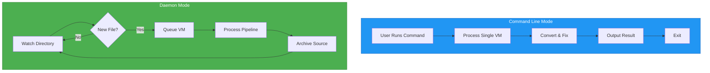
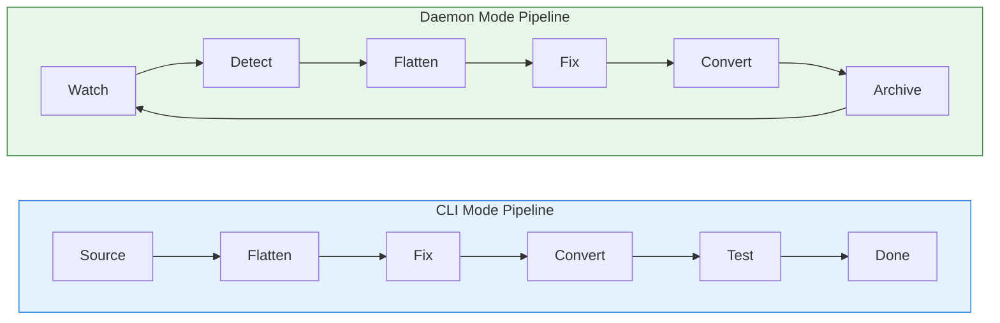
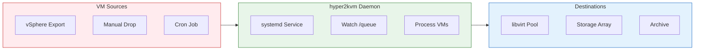

# hyper2kvm: Daemon vs CLI Mode

## Architecture Overview



---

## Command Line Mode

### Use Case
**Interactive, one-time conversions**

### Workflow
```
User → Command → Process → Result → Exit
```

### Example
```bash
hyper2kvm local \
  --source vm.vmdk \
  --output /vms/converted.qcow2 \
  --compress
```

### Characteristics
- ✓ Interactive control
- ✓ Immediate feedback
- ✓ Single VM focus
- ✓ Manual execution

---

## Daemon Mode

### Use Case
**Automated, continuous processing**

### Workflow
```
Drop File → Auto-Detect → Process → Archive → Repeat
```

### Example
```bash
# Start daemon
hyper2kvm --config daemon.yaml

# Drop files and they're auto-processed
cp *.vmdk /queue/
```

### Characteristics
- ✓ Unattended operation
- ✓ Batch processing
- ✓ Watch directory
- ✓ Production deployments

---

## Pipeline Comparison



---

## Decision Matrix

| Feature | CLI Mode | Daemon Mode |
|---------|----------|-------------|
| **Execution** | Manual | Automatic |
| **Volume** | Single VM | Multiple VMs |
| **Use Case** | Testing, Dev | Production |
| **Monitoring** | Terminal | Logs/Journal |
| **Integration** | Scripts | CI/CD, Cron |
| **Restart** | Manual | Systemd |

---

## Daemon Architecture Detail

```mermaid
graph TB
    subgraph INPUT["Input Layer"]
        I1[/queue/vm1.vmdk]
        I2[/queue/vm2.ova]
        I3[/queue/vm3.vhd]
    end

    subgraph WATCH["Watchdog Monitor"]
        W1[inotify Events]
        W2[File Detection]
        W3[Type Classification]
    end

    subgraph PROCESS["Processing Engine"]
        P1[Flatten Chain]
        P2[Offline Fixes]
        P3[Format Convert]
        P4[Validation]
    end

    subgraph OUTPUT["Output Layer"]
        O1[/output/vm1/]
        O2[/output/vm2/]
        O3[.processed/archive]
    end

    INPUT --> WATCH
    WATCH --> PROCESS
    PROCESS --> OUTPUT

    style INPUT fill:#FFF3E0,stroke:#F57C00
    style WATCH fill:#E1F5FE,stroke:#0277BD
    style PROCESS fill:#F3E5F5,stroke:#7B1FA2
    style OUTPUT fill:#E8F5E9,stroke:#2E7D32
```

---

## Production Deployment



### Deployment Commands
```bash
# Install daemon
sudo cp daemon.yaml /etc/hyper2kvm/
sudo systemctl enable --now hyper2kvm.service

# Monitor
sudo journalctl -u hyper2kvm.service -f

# Drop VMs
cp exports/*.vmdk /var/lib/hyper2kvm/queue/
```

---

## Key Takeaways

### CLI Mode
- **Interactive** - Full control, immediate feedback
- **Development** - Testing and troubleshooting
- **Single VM** - One-off conversions

### Daemon Mode
- **Automated** - Drop and forget
- **Production** - 24/7 processing
- **Scale** - Batch operations

### Choose CLI for:
- Development and testing
- Manual control needed
- Single VM migrations
- Interactive troubleshooting

### Choose Daemon for:
- Production environments
- Automated workflows
- Batch processing
- CI/CD integration
