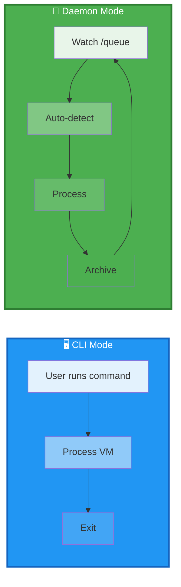

# hyper2kvm: Quick Mode Comparison

## One-Page Overview



---

## Side-by-Side Comparison

| Aspect | CLI Mode | Daemon Mode |
|--------|----------|-------------|
| **Trigger** | Manual command | File drop |
| **Process** | One VM | Continuous |
| **Feedback** | Interactive | Logs |
| **Use Case** | Dev/Testing | Production |
| **Deployment** | Ad-hoc | systemd service |

---

## Quick Commands

### CLI Mode
```bash
# Single VM conversion
hyper2kvm local --source vm.vmdk --output vm.qcow2
```

### Daemon Mode
```bash
# Start daemon
sudo systemctl start hyper2kvm.service

# Drop files → auto-processed
cp *.vmdk /var/lib/hyper2kvm/queue/
```

---

## When to Use

### Use CLI Mode 👨‍💻
- Testing a single VM
- Development work
- Need immediate feedback
- Manual control required

### Use Daemon Mode ⚙️
- Production environment
- Batch processing
- Automated workflows
- Overnight operations
- CI/CD integration
